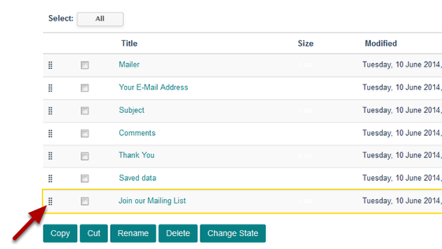

Add Fields to a Form
======================================================================================================

.. note:: These user guides are being phased out and replaced with the guides on `Haiku Knowledge Base <https://fry-it.atlassian.net/wiki/display/HKB/Haiku+Knowledge+Base>`_

This shows you how to add a new field to a form. 	

Form
-------------------------------------------------------------------------------------------

   

Go to the form you would like to add a new field to. 

Add new
-------------------------------------------------------------------------------------------

.. image:: images/Add_Fields_to_a_Form/media_1402400364238.png
   :align: center
   

Click on **Add new ...** and select the field to be added. In this case we are adding a Checkbox field. 

Field details
-------------------------------------------------------------------------------------------

.. image:: images/Add_Fields_to_a_Form/add-checkbox.png
   :align: center
   

Enter field details:
1. Give your field a name.
2. Provide more details / help if necessary. 
3. Save the field.

Field created
-------------------------------------------------------------------------------------------

.. image:: images/Add_Fields_to_a_Form/media_1402400781038.png
   :align: center
   

After saving the field you will see a page confirming the field creation. 

Your form
-------------------------------------------------------------------------------------------

   

The new field is added to the bottom of your form. 

Change the order of the fields
-------------------------------------------------------------------------------------------

.. image:: images/Add_Fields_to_a_Form/media_1402400981541.png
   :align: center
   

To move the field to a different section of your form click on **Contents** on the toolbar at the top of the page. 

Move field
-------------------------------------------------------------------------------------------

   

This lists all the fields in the order that they display. Click on the set of dots to the left of the name of the field you would like to move and drag it to the required location. In the example below the Join our Mailing List field has been moved to above the Your E-mail Address field:

   

