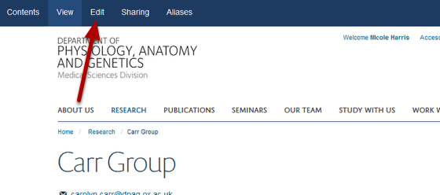
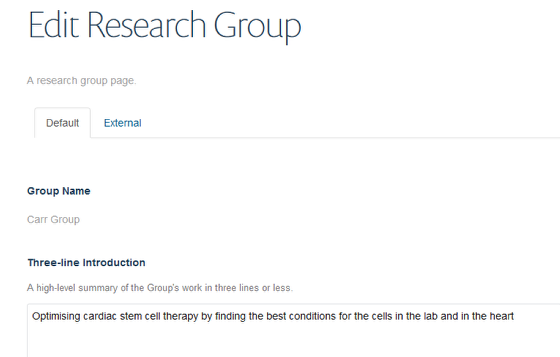
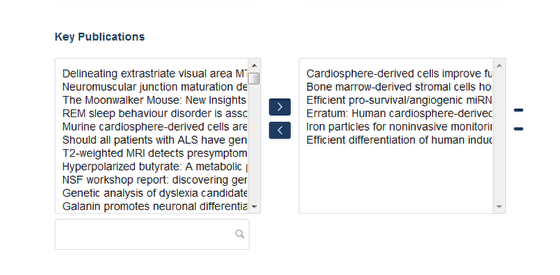
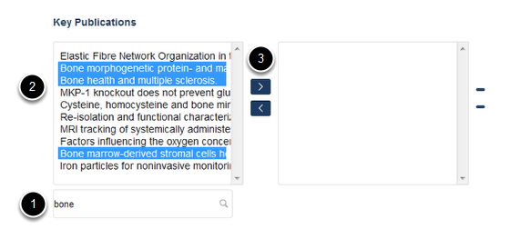
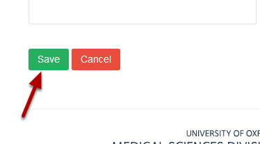

Add Publications to a Research Group Page
======================================================================================================

.. note:: These user guides are being phased out and replaced with the guides on `Haiku Knowledge Base <https://fry-it.atlassian.net/wiki/display/HKB/Haiku+Knowledge+Base>`_

Publications are fed to the website from Symplectic. As all the publications entered into Symplectic by members of your department are available you will need to choose the publications that are relevant to your Research Group.	

Select edit mode
-------------------------------------------------------------------------------------------

   

Go to your Research Group page. Click on **Edit** on the tool bar at the top of the page to bring up the editing interface: 

   

Add publications
-------------------------------------------------------------------------------------------

   

Scroll down the page until you reach the Key Publications section at the bottom of the page.
The box on the left contains all publications entered into Symplectic by members of your department with profiles. The box on the right shows publications appearing on your Research Group page.
To choose the relevant publications for your Research Group use the search box located under the left hand column.

The search box
-------------------------------------------------------------------------------------------

   

1. Type a word or phrase from the title of the publication you are searching for into the search box to bring up a list of publications containing that term.
2. Highlight the relevant publication(s) in the list in the left hand column.
3. Click on the top arrow to move the publication to the right hand column.

Save your changes
-------------------------------------------------------------------------------------------

   

Scroll to the bottom of the page. Click on the **Save** button. 

