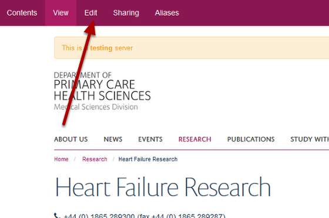
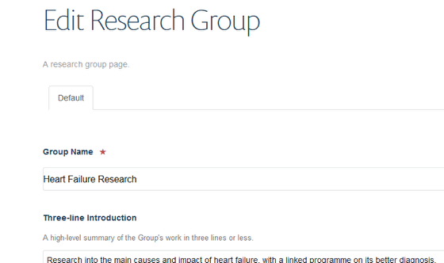
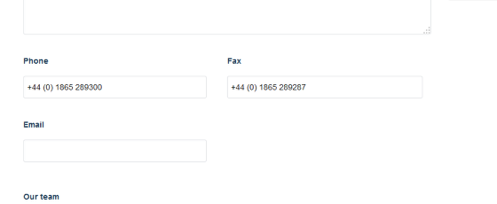

Add / Edit Contact Details
======================================================================================================

.. note:: these user guides are being phased out and replaced with guides on `Haiku Knowledge Base <https://fry-it.atlassian.net/wiki/display/HKB/Haiku+Knowledge+Base>`_

Shows you how to change the contact details on a research group page. You need to log in first. If you are unsure how to do this go to **Log in to your site with single sign on** guide in the Getting Started section.	

Select edit mode
-------------------------------------------------------------------------------------------

   

Go to the Research section of your website and find the Research Group page you would like to edit. 

Click on **Edit** on the tool bar at the top of the page to bring up the editing interface: 

   

Contact details
-------------------------------------------------------------------------------------------

   

Scroll down the page until you see the the Phone, Fax and Email boxes.
Make and save your changes. The Save button is at the bottom of the page.

