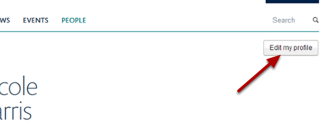
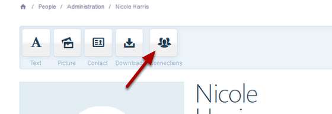
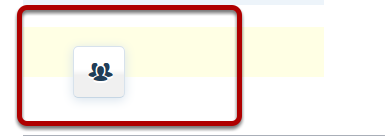
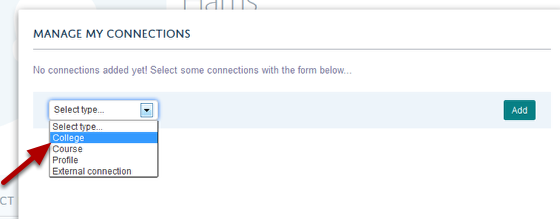
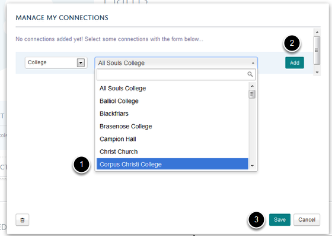
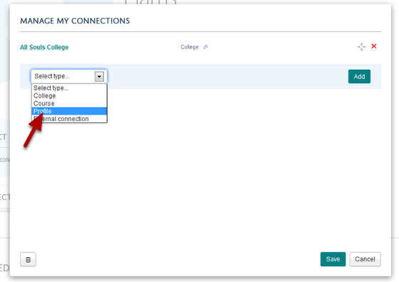
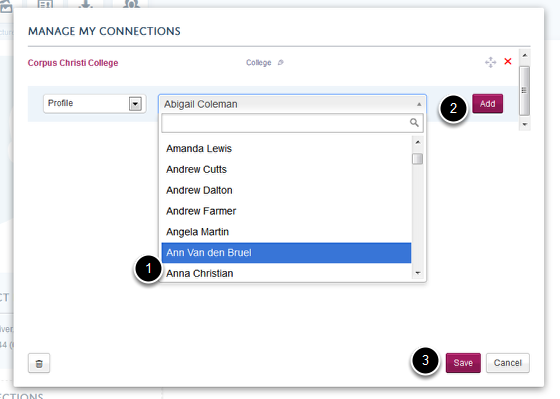
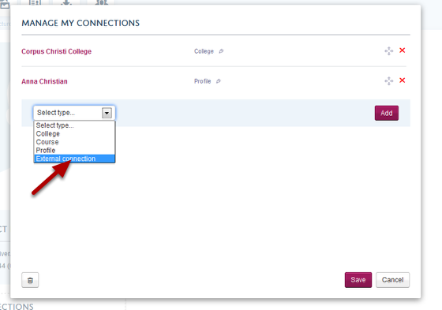
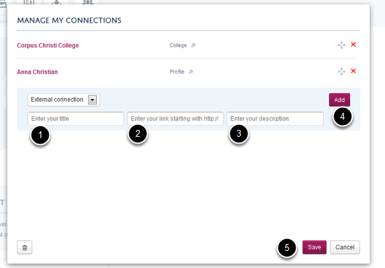
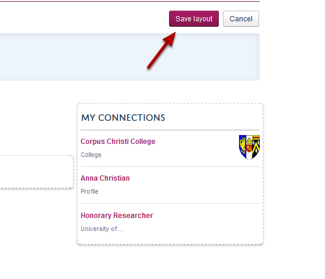

Add a Connections Tile to your Profile
======================================================================================================

The Connections Tile enables you to provide links to Research Groups, Colleges, other profiles and external institutions that you might be affiliated to. Once you have added a Connections Tile the Research Groups that you are a member of will be added automatically (after adding the Connections Tile you may have to refresh the page before you see your Research Group connections). 	

Edit profile
-------------------------------------------------------------------------------------------

   

Go to your profile and click on the Edit my profile button.

Select Connections Tile
-------------------------------------------------------------------------------------------

   

You will now see a set of icons at the top of your Profile. Click on Connections and keeping your mouse button pressed down drag the icon to the part of your page where you would like to add the Download tile (for example underneath your contact details or under your list of publications).

Place Connections Tile onto your page
-------------------------------------------------------------------------------------------

   

When you get to a section of your page where you can place the tile you will notice that the a pale coloured box appears. Letting go of your mouse button will place the Connections Tile in the place of the coloured box. 

Add a College connection
-------------------------------------------------------------------------------------------

   

To add a College connection click on the drop down list and select College.

   

1. Select your college from the drop down list.
2. Click on Add.
3. Click on Save if you have finished adding connections. If you would like to add further connections follow the instructions below:

Add a connection to another person's profile
-------------------------------------------------------------------------------------------

   

Select Profile from the drop down list to bring up a list of people who are in your department to bring up a list of everyone who has a profile in your department.

   

1. Select the person you want to connect to from the drop down list.
2. Click on the Add button.
3. Click on Save if you have finished adding connections or follow the instructions below to add a connection to an external organisation.

Add a connection to an external organisation
-------------------------------------------------------------------------------------------

   

Select External connection from the drop down list. 

Enter external connection details
-------------------------------------------------------------------------------------------

   

1. Enter the title of your affiliation.
2. Enter the web address of the organisation.
3. You can add a short description of your affiliation / name of the organisation.
4. Click on the Add button.
5. Save your changes.

Save layout
-------------------------------------------------------------------------------------------

   

Once you have finished adding connections click on the Save Layout button. 

