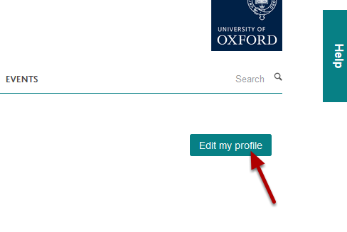
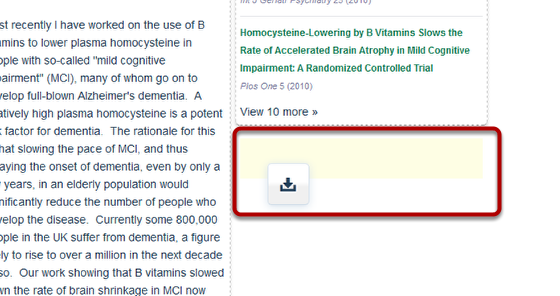
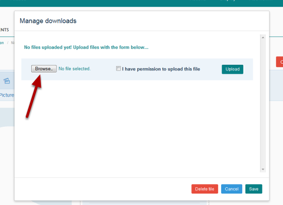
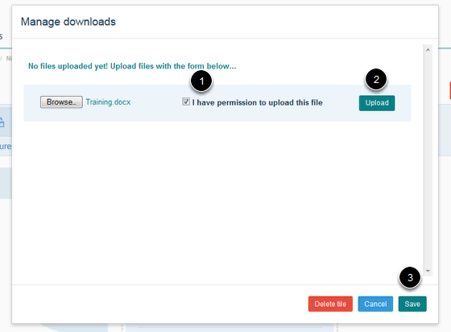
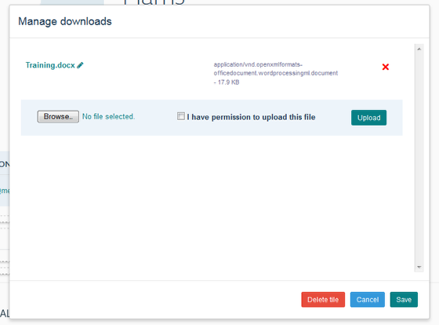
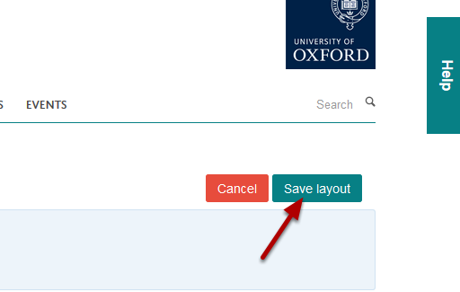

Add a Download Tile to your Profile
======================================================================================================

.. note:: these user guides are being phased out and replaced with the guides on `Haiku Knowledge Base <https://fry-it.atlassian.net/wiki/display/HKB/Haiku+Knowledge+Base>`_

You can upload documents to your profile for your website visitors to download. The maximum size per file is 5MB. Before you can upload documents you need to add a Download Tile to your Profile. This shows you how to do this. 	

Edit my profile
-------------------------------------------------------------------------------------------

   

Click on the **Edit** my profile button under the University logo. 

Select Download Tile
-------------------------------------------------------------------------------------------

.. image:: images/Add_a_Download_Tile_to_your_Profile/media_1402987744312.png
   :align: center
   

You will now see a set of icons at the top of your Profile. Click on **Downloads** and keeping your mouse button pressed down drag the icon to the part of your page where you would like to add the Download tile (for example underneath your contact details or under your list of publications). 

Place Download Tile onto your page
-------------------------------------------------------------------------------------------

   

When you get to a section of your page where you can place the tile you will notice that the a pale coloured box appears. Letting go of your mouse button will place the Download Tile in the place of the coloured box. 

Upload a document
-------------------------------------------------------------------------------------------

   

When you have placed your Download Tile onto your page a file upload box will display. Click on the **Browse ...** button and navigate to the document you would like to upload. 
If the document is larger than 5MB you cannot upload it.  

   

After locating your document:
1. Select the check box confirming that you have permission to upload the document.
2. Click on the **Upload** button.
3. Click on **Save**.

Add additional documents
-------------------------------------------------------------------------------------------

   

Repeat the process if you would like to add additional documents. 

Save your page layout
-------------------------------------------------------------------------------------------

   

When you have finished adding the Download Tile and your documents click on the **Save layout** button under the University logo. 

