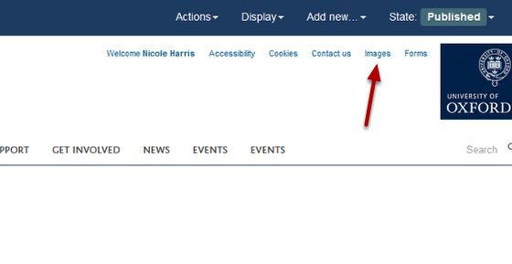
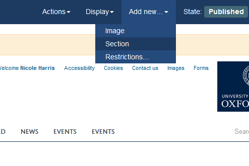
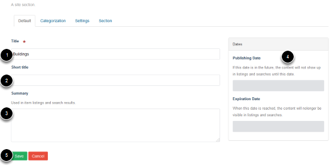

Add a Folder to the Image Library
======================================================================================================

This shows you how to add a new folder to the Image Library. 	

Images
-------------------------------------------------------------------------------------------

   

Click on Images on the right side of the top of the page. 

Add Folder
-------------------------------------------------------------------------------------------

   

Click on **Add new...** on the toolbar at the top of the page.
Select **Section**. 

   

Enter details of the new folder:
1. Name of the folder
2. Short title - if entered at the time of creating the folder this forms the last part of the web address 
3. Summary of the folder contents (optional)
4. Ignore the publishing dates - images are automatically published.
 
Save the folder:
5. Click on **Save**. 

