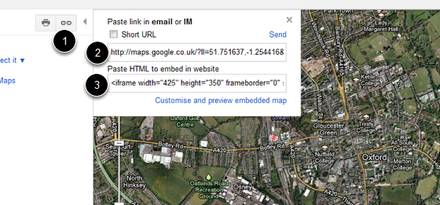
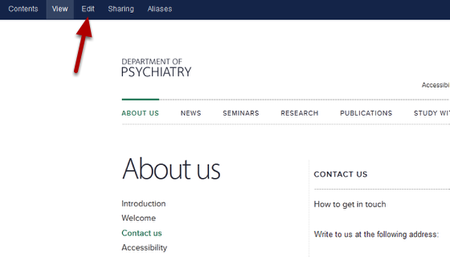
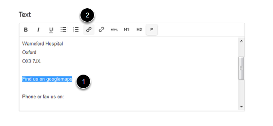
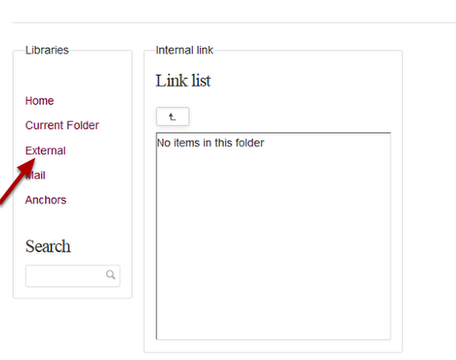
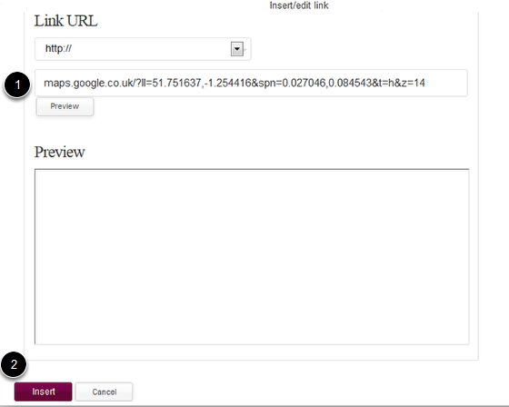
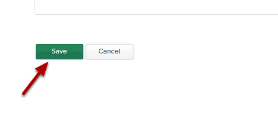
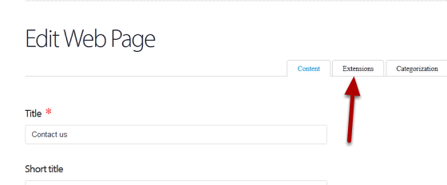
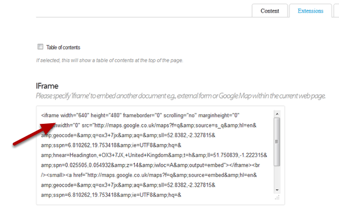
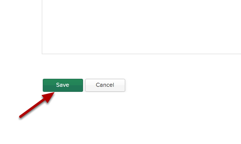

Add a Googlemap to an About Us page
======================================================================================================

There are two ways to add a googlemap to a page. You can either link to it or embed it into the page.	

Find the googlemap link
-------------------------------------------------------------------------------------------

   

Go to the googlemap you would like to link to.
1. Click on the link icon.
2. Copy the top link if you would like to link to the map.
3. Copy the bottom iframe link if you would like to embed the map into your page.

Find your page
-------------------------------------------------------------------------------------------

   

Go to the page where you would like to add a googlemap and click on Edit. 

Linking to a googlemap
-------------------------------------------------------------------------------------------

   

Scroll down the page until you reach the text box. 
1. Highlight the text you would like to use to create you link.
2. Click on the link icon. 

Create your link
-------------------------------------------------------------------------------------------

   

Click on External.

   

1. Paste your link into the Link box.
2. Click on Insert.

Save your changes
-------------------------------------------------------------------------------------------

   

Scroll to the bottom of the page and click on Save.

Embed a googlemap
-------------------------------------------------------------------------------------------

   

To embed a map find the page and click on Edit (as above). Then click on the Extensions tab.

Paste the iframe link
-------------------------------------------------------------------------------------------

   

Paste the iframe link (see the first step of this tutorial) into the IFrame box.

Save your changes
-------------------------------------------------------------------------------------------

   

Scroll to the bottom of the page and click on the Save button. 

