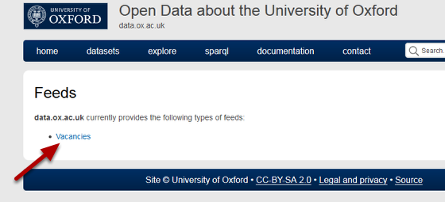
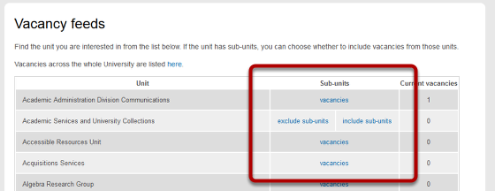
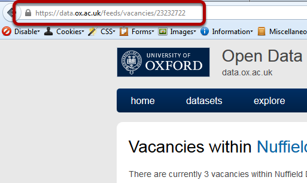
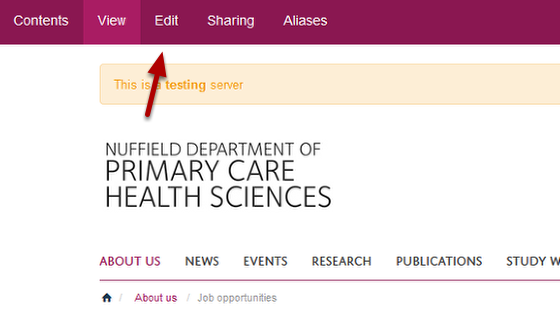
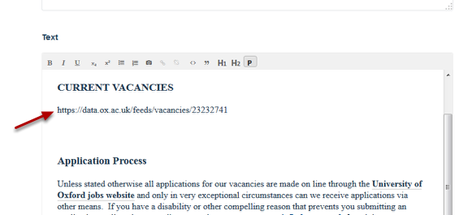
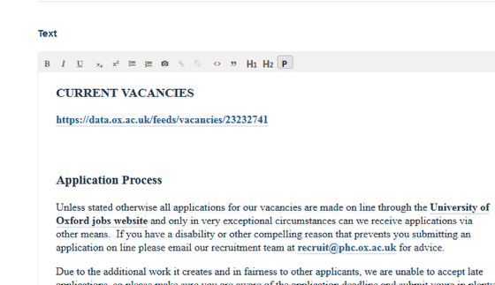

Add a Jobs Feed
======================================================================================================

You can add a Job Feed to any page on your website. This shows you how to do this. 	

Find your jobs feed address
-------------------------------------------------------------------------------------------

   

Go to https://data.ox.ac.uk/feeds/ and click on Vacancies to take you to a page listing jobs feeds for all departments at the University. 

   

Find your department and click on the vacancies link.

   

Copy the web address.

Your site
-------------------------------------------------------------------------------------------

   

Go to the page you would like to add the jobs feed to and click on **Edit** on the tool bar at the top of the page. 

   

Scroll down the page until you reach the **Text** box. Paste the vacancies web address you copied from the data.ox.ac.uk into your page. 

Create a link
-------------------------------------------------------------------------------------------

   

Turn the web address you just copied into a link linking to the web address you just copied and pasted.
Scroll down to the bottom of the page and save your changes. 
You will now see that you have a list of vacancies in your page. Clicking on a job title will bring up details of the vacancy.

   

