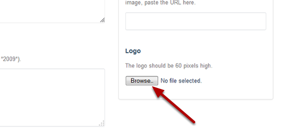
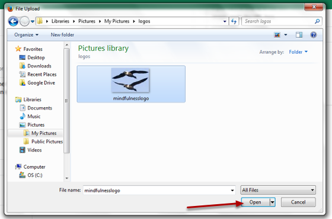

Add a Logo to a Research Group Page
======================================================================================================

.. note:: These user guides are being phased out and replaced with the guides on `Haiku Knowledge Base <https://fry-it.atlassian.net/wiki/display/HKB/Haiku+Knowledge+Base>`_

Logos appear at the top of a Research Group page next to the contact details. Logos should be 60 pixels high. This shows you how to add the logo below:	

Group logos
-------------------------------------------------------------------------------------------

   

Select Edit mode
-------------------------------------------------------------------------------------------

   

Go to your Research Group page. Click on **Edit** on the top tool bar. 

Upload logo
-------------------------------------------------------------------------------------------

   

Scroll down the page until you see the heading Logo on the left hand side of the page. 
Click on the **Browse...** button. 

Find your image
-------------------------------------------------------------------------------------------

   

Find your image on your computer and click on **Open**.

Save your changes
-------------------------------------------------------------------------------------------

   

Scroll down to the bottom of the page and click on the **Save** button. 

