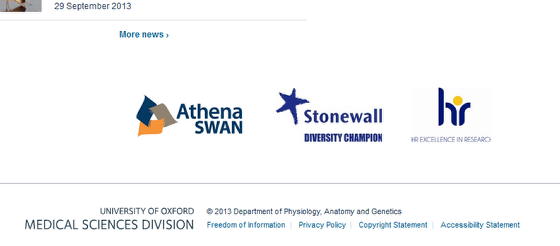
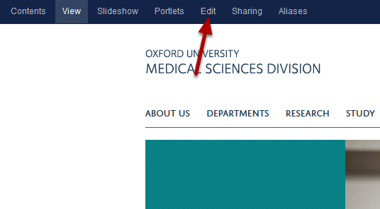
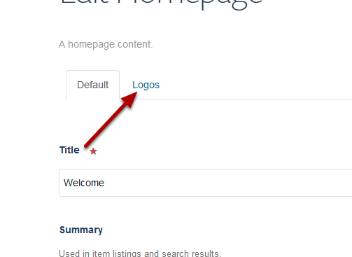
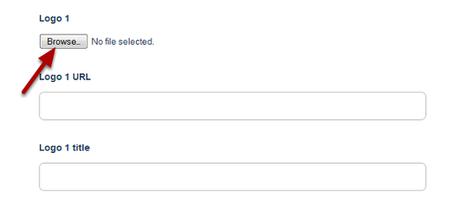
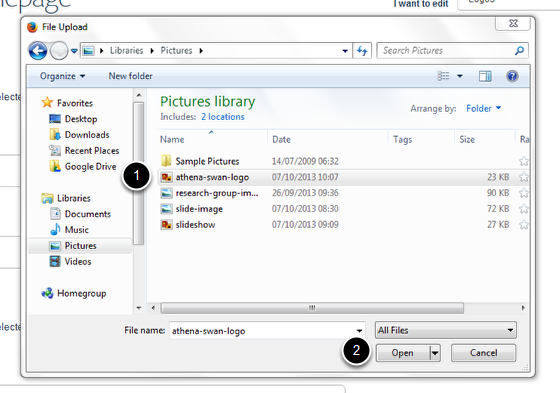
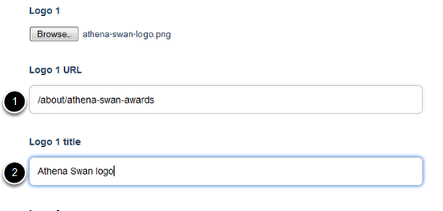
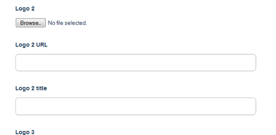

Add a Logo to your Homepage
======================================================================================================

.. note:: these user guides are being phased out and replaced with the guides on `Haiku Knowledge Base <https://fry-it.atlassian.net/wiki/display/HKB/Haiku+Knowledge+Base>`_

This shows you how to add a logo to your homepage. 	

Logos
-------------------------------------------------------------------------------------------

   

You can add logos to the bottom of the homepage.

Edit homepage
-------------------------------------------------------------------------------------------

   

Go to your homepage and click on **Edit** on the toolbar at the top of the page. 

Edit logos
-------------------------------------------------------------------------------------------

   

Click on the **Logos** tab.

Add logo
-------------------------------------------------------------------------------------------

   

To add your logo click on the **Browse...** button.

Select image
-------------------------------------------------------------------------------------------

   

1. Find your image.
2. Click on **Open**.

Add logo details
-------------------------------------------------------------------------------------------

   

1. If you would like to link the logo enter the web address here. If you are linking to part of your own site don't include the first part of the web address in the box - eg instead of www.medsci.ox.ac.uk/about/athena-swan-awards enter /about/athena-swan-awards
2. Enter a title for the logo. This doesn't display but creates a text description for people who are using screen reading software or text only browsers. 

Add further logos and save
-------------------------------------------------------------------------------------------

   

Add further logos as required. Once you have added your logos scroll down to the bottom of the page and click on the **Save** button. 

