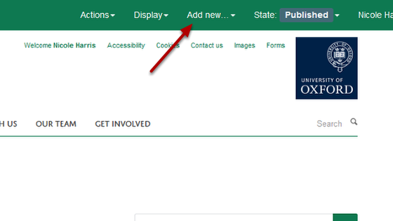
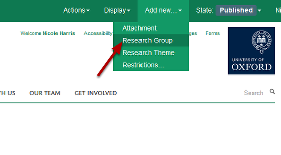
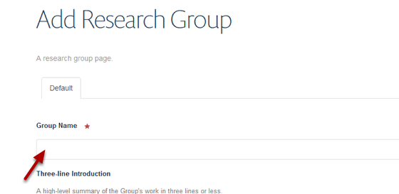

Add a New Research Group
======================================================================================================

.. note:: these user guides are being phased out and replaced with the guides on `Haiku Knowledge Base <https://fry-it.atlassian.net/wiki/display/HKB/Haiku+Knowledge+Base>`_

Shows you how to add a new Research Group to the website. You need to log into the site first. 	

Add new option
-------------------------------------------------------------------------------------------

   

Go to the Research section of the website. Click on **Add new** on the toolbar.

Add your Research Group
-------------------------------------------------------------------------------------------

   

Click on **Research Group**.

Name your Research Group
-------------------------------------------------------------------------------------------

   

Enter the name of your new Research Group into the **Group Name** box. 

Save your Research Group
-------------------------------------------------------------------------------------------

   

Scroll to the bottom of the page. 
Click on **Save**. 

