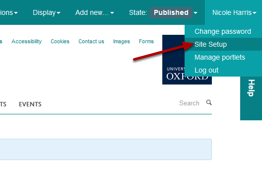
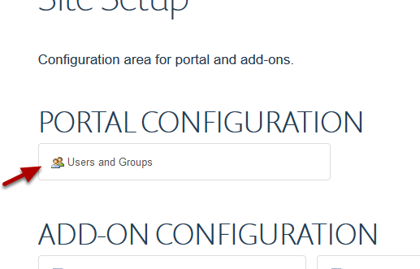
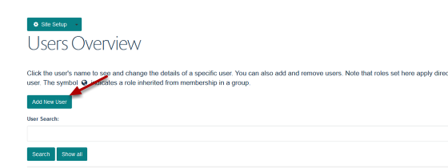
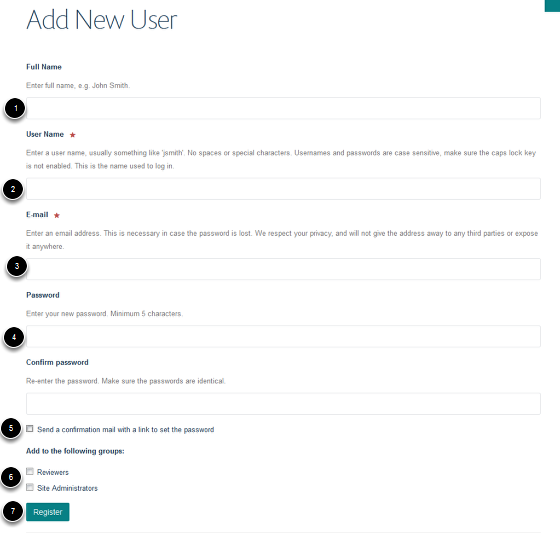

Add a New User
======================================================================================================

.. note:: These user guides are being phased out and replaced with the guides on `Haiku Knowledge Base <https://fry-it.atlassian.net/wiki/display/HKB/Haiku+Knowledge+Base>`_

Most users are added when a profile is created - but this shows you how to add a user manually.	

Go to Site Setup
-------------------------------------------------------------------------------------------

   

You'll find the link to Site Setup in the drop down box below your name. If you can't see that option, you aren't a site administrator, so you'll need to ask your editor in chief for help.

Go to Users and Groups
-------------------------------------------------------------------------------------------

   

Click on **Users and Groups**. 

Add your user
-------------------------------------------------------------------------------------------

   

Click the Add New User button. 

(If you're not sure whether the user is already in the system, then you can search for the user by name first)

User details
-------------------------------------------------------------------------------------------

   

1. Enter name.
2. The User Name should be the Oxford username - there are instructions on how to find a username in the Find an Oxford Username tutorial.
3. The E-mail should be the usual Oxford email address for this person. If the person isn't a member of the University, you will need to apply for a Virtual University Card to get them an Oxford username and password to use for login and editing.
4. You are asked to supply a password, any random password will do and you don't need to remember this. **NB DO NOT put a user's single sign on password here.** 
**5. Clear** the 'Send a confirmation mail' box. People will log in with their single sign on username and password. 
6. Unless you want to give the user permissions to edit the entire site, **leave** the 'Add to the following groups' boxes **blank**.
7. Click register.

