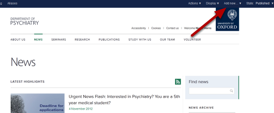
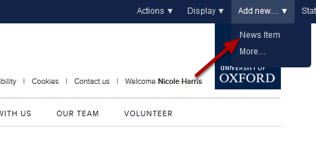
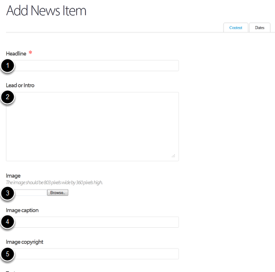
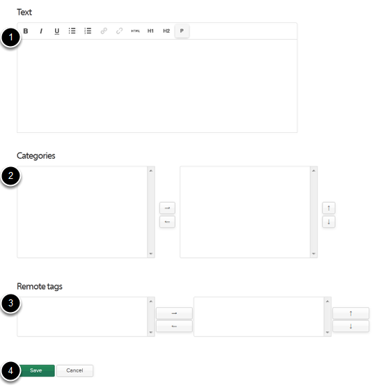
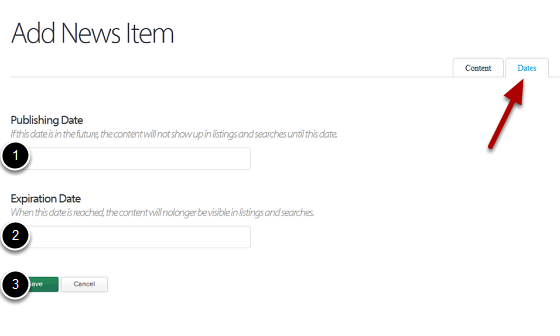

Add a News Item
======================================================================================================

Go to the News section
-------------------------------------------------------------------------------------------

   

Go to the News section of your website and click on Add new... on the top right hand side of the tool bar at the top of the screen. 

Add a new page
-------------------------------------------------------------------------------------------

   

Click on News Item to bring up an Add News Item page.

Add News Items details
-------------------------------------------------------------------------------------------

   

Enter details of your News Item:
1. The Headline of the News item. 
2. Lead or Intro - a short introduction or highlight of your news item. This displays under the headline on the list of News Items in the News section. 
3. You can add an image to your news item and if necessary add a caption to your image (4) and copyright information (5). The image will appear on both the news item page and the page listing the news items. 

Article text
-------------------------------------------------------------------------------------------

   

1. Enter the main text of your News article into the Text box.
2. If Categories for different types of News Item have been set up you can select them from here (to find out how to add News Categories see the Add a new Category for News in the Editor-in-Chief section).
3. Click on the Save button.

Publication dates
-------------------------------------------------------------------------------------------

   

If you would like to set a publication and / or expiry date click on the Dates tab and enter:
1. The date you would like the New Item to be published.
2. The date you would like to New Item to expire. 
3. Save your changes. 
This section is optional. If you don't complete this section the News Item will appear as soon as you have published it.

