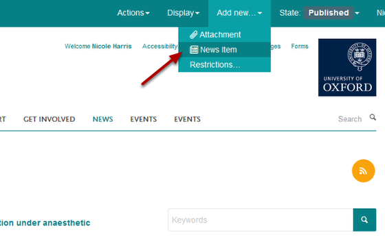
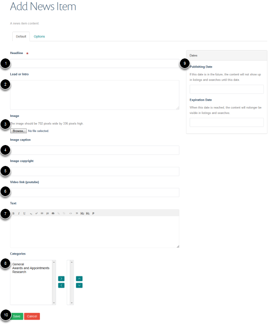
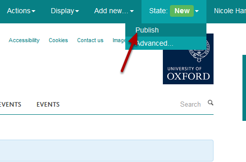
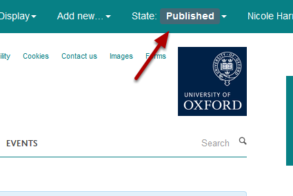

Add a News Item
======================================================================================================

This shows you how to add a new News Item to your website. 	

Add new News Item
-------------------------------------------------------------------------------------------

   

Go to the News section of your website. Click on **Add new...** on the top right hand side of the tool bar at the top of the screen and select **News Item** from the drop down list.

Add News Items details
-------------------------------------------------------------------------------------------

   

Enter details of your News Item:
1. The Headline of the News item. 
2. Lead or Intro - a short introduction or highlight of your news item. This displays under the headline on the list of News Items in the News section. 
3. You can upload an image which will appear on both the news item and the page listing the news items. 
4. Caption for your image.
5. Image copyright details. 
6. You can include a YouTube video instead of an image. Paste the YouTube web address into the **Video link (youtube)** box. 
7. Enter the main content of your news item.
8. You can select organise your news items by category. Select the relevant category in the left column and move across to the right column using the top arrow. 
9. You can specify publications dates - the item will only appear in listings and search between those dates. If someone knows the web address they will be able to see the page. You need to publish your page for this to work. This section is optional - if it left blank the item will be visible to the public as soon as it is published. 
10. Click on **Save**.

Publish news item
-------------------------------------------------------------------------------------------

   

Click on **State** and select **Publish**.

   

You will now see that your item is published. 

