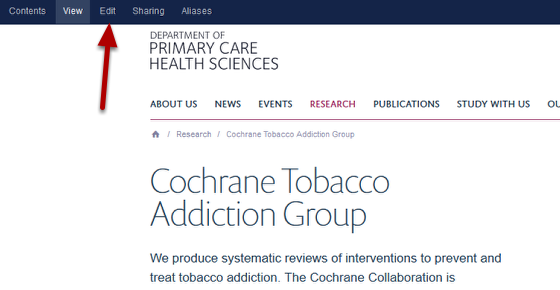
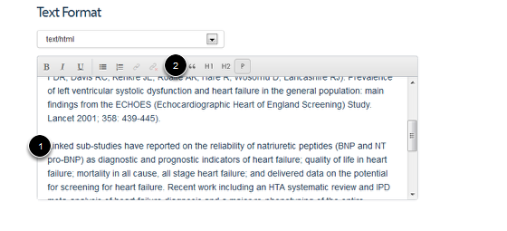
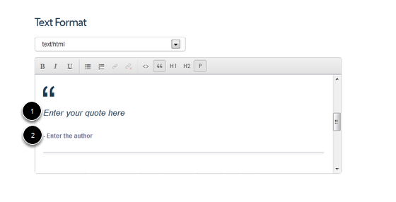
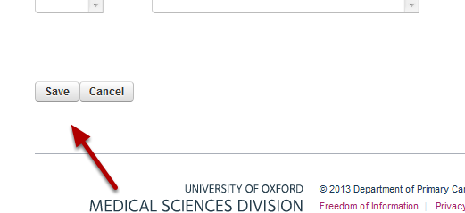
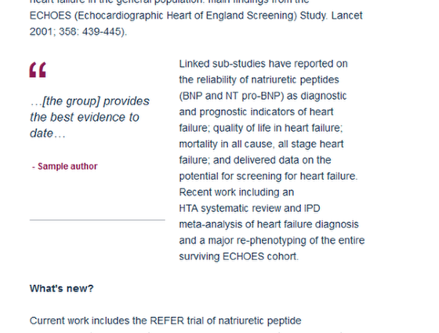

Add a Quote 
======================================================================================================

This shows you how to add a quote to your research group page. 	

Research Group page
-------------------------------------------------------------------------------------------

   

Go to the Research Group page you would like to edit and click on Edit on the left hand side of the toolbar at the top of the page to bring up the editing interface.

Go to the text editor
-------------------------------------------------------------------------------------------

   

Scroll down the page until you reach the text editor. 
1. Place your cursor on the part of the page where you would like to add the quote.
2. Click on the quote icon on the text editor's toolbar. 

Enter your quote
-------------------------------------------------------------------------------------------

   

1. Click on the Enter your quote here text, delete and add your quote. 
2. Repeat for the author

Save your page
-------------------------------------------------------------------------------------------

   

Scroll to the bottom of the page and click on the Save button. 
You will now see your quote in the main text section of your page:

   

