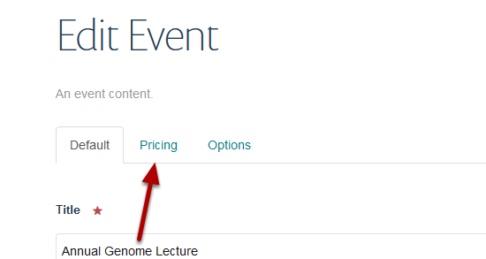
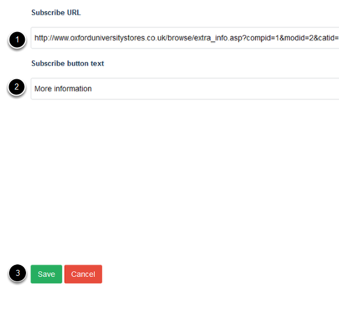

Add a Registration Link to an Event
======================================================================================================

.. note:: these user guides are being phased out and replaced with the guides on `Haiku Knowledge Base <https://fry-it.atlassian.net/wiki/display/HKB/Haiku+Knowledge+Base>`_

This shows you how to add a registration / further information link to an event.	

Edit event
-------------------------------------------------------------------------------------------

   

Go to your event and click on Edit on the toolbar at the top of the page. 

Pricing
-------------------------------------------------------------------------------------------

   

Click on the **Pricing** tab.

Add web address
-------------------------------------------------------------------------------------------

   

1. Enter your link web address in the **Subscribe URL** box. 
2. Enter the text to appear on the link button. 
3. Click on **Save**.

