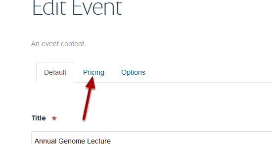
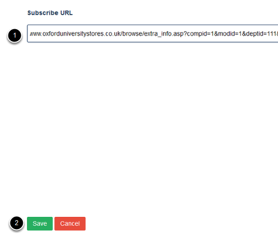
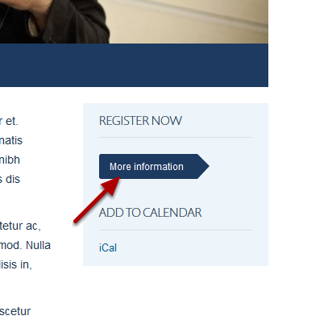

Add a Registration Link to an Event
======================================================================================================

This shows you how to add a registration link to an event.	

Edit event
-------------------------------------------------------------------------------------------

   

Go to your event and click on Edit on the toolbar at the top of the page. 

Pricing
-------------------------------------------------------------------------------------------

   

Click on the **Pricing** tab.

Add web address
-------------------------------------------------------------------------------------------

   

1. Enter your link web address in the Subscribe URL box. 
2. Click on Save.

Registration link
-------------------------------------------------------------------------------------------

   

Your link displays above the iCal link. 

