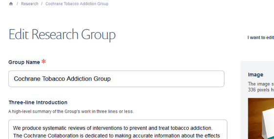
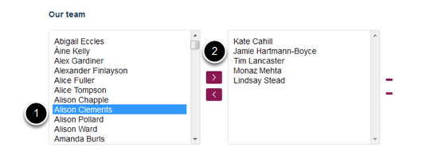

Add a Research Group Member
======================================================================================================

.. note:: These user guides are being phased out and replaced with the guides on `Haiku Knowledge Base <https://fry-it.atlassian.net/wiki/display/HKB/Haiku+Knowledge+Base>`_

Shows you how to add a new team member to a research group. Before adding someone to a Research Group you need to ensure that they have a profile.	

Research Group page
-------------------------------------------------------------------------------------------

   

Go to your Research Group page. Click on **Edit** on the toolbar at the top of the page to bring up the editing interface:

   

Add new group member
-------------------------------------------------------------------------------------------

   

Scroll down the page until you reach the Our team section. 
1. Select the new group member from the list on the left (this is a list of staff with profiles in your department).
2. Click on the top arrow to move the name to the right hand column (this is a list of staff in the research group).

Save your changes
-------------------------------------------------------------------------------------------

   

Scroll to the bottom of the page.
Click on **Save**.

