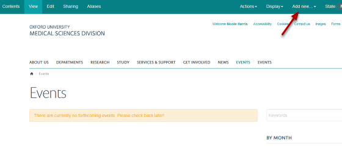
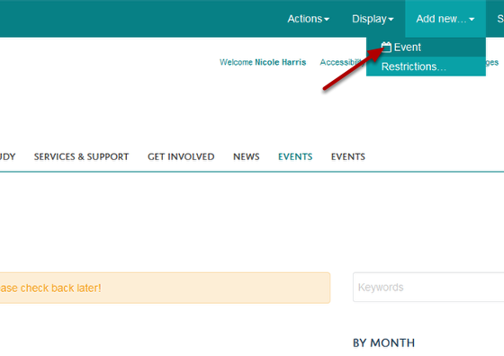
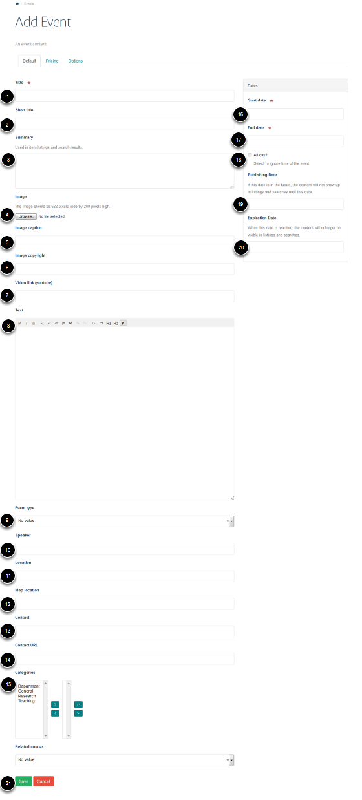
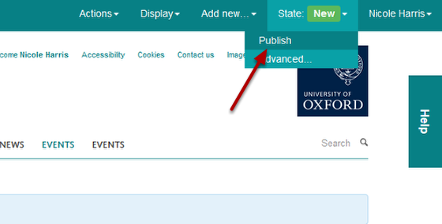

Add a Seminar / Event - Overview
======================================================================================================

.. note:: these user guides are being phased out and replaced with the guides on `Haiku Knowledge Base <https://fry-it.atlassian.net/wiki/display/HKB/Haiku+Knowledge+Base>`_

This gives you a general overview of how to add a new seminar. The event title and date are compulsory; all the other fields are optional. 	

Go to the Seminars section
-------------------------------------------------------------------------------------------

   

To add a new Seminar go to the Seminars section of the website and click on Add new... on the right hand side of the top toolbar. 

Add Event
-------------------------------------------------------------------------------------------

   

Click on Event.

Event details
-------------------------------------------------------------------------------------------

   

You can enter the following seminar/event information: 
1. Name of your seminar/event (this is compulsory).
2. If you enter a short title this will form the last part of the web address of your page (eg the wilkins part of the following address: http://www.dpag.ox.ac.uk/seminars/wilkins). If you don't enter a short title this part of the web address will be the title of your seminar/event.
3. Short description. This displays in a slightly larger font than text entered into the text box (no. 8). 
4. You can include an image on your seminar page. 
5. Enter a caption for your image.
6. Copyright information - this displays in small white text in the top right hand side of your image. 
7. You can include a YouTube video on the page instead of an image. Enter the web address of the YouTube video in the Video link (YouTube) field. 
8. Text box - enter any other information about the seminar in here. 
9. If event types have been set up you can select one from the drop down list. 
10. Enter the speaker's name - this displays under the seminar title. 
11. Enter the seminar location. 
12. If you would like a google map on the page showing the location enter the address or postcode here. 
13. Enter a contact name.
14. You can enter a contact URL - the contact name will become a link to this page. 
15.  If categories of seminars have been set up you can allocate your seminar to one of these. 
16. Click in the start date box to open a calendar. Select the start date and time on the calendar.
17. Select the end date. 
18. Select the All day? check box if you would like to indicate this is an all day event. 
19. Select a publication date. The event won't be visiable to non logged in users before this time. 
20. Enter an expiry date if you would like the event to unpublish. The event won't be deleted, it just won't be visible to non logged in users. 
21. Save the Event.

Publish event
-------------------------------------------------------------------------------------------

   

To publish your page click on the **State** button and select **Publish**. 

