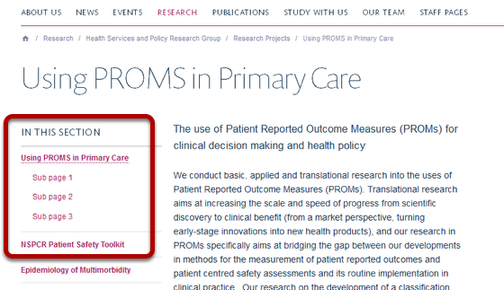
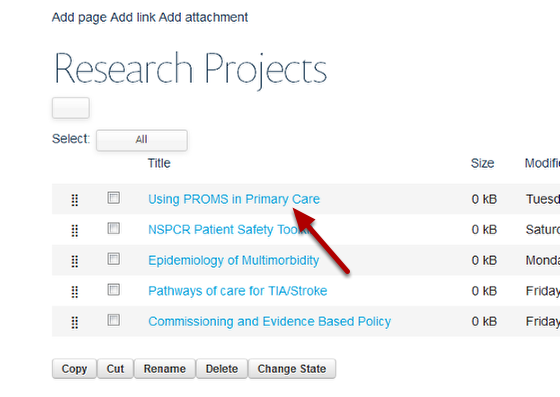
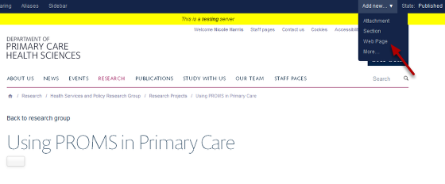
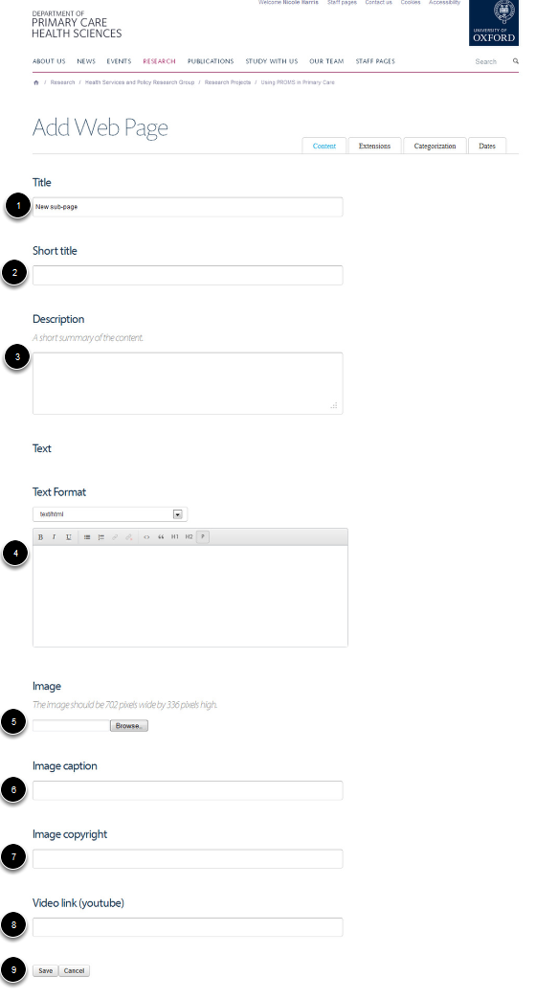
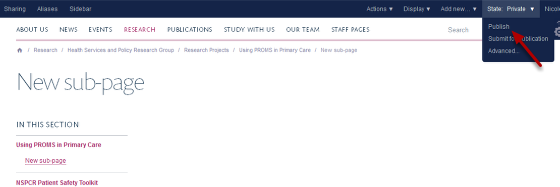

Add a Sub-page on a Listing Column Page
======================================================================================================

You can create a series of sub-pages linking from a page in a listing column. These will be linked to from the column left hand navigation as shown below:	

   

Go to your listing column
-------------------------------------------------------------------------------------------

.. image:: images/Add_a_Sub-page_on_a_Listing_Column_Page/media_1366710038857.png
   :align: center
   

Go to the listing column where you would like to add sub-pages and click on Manage. This button will appear when you move your cursor over the column heading. 

Select your page
-------------------------------------------------------------------------------------------

   

Click on the name of the page you would like to add your sub-page to. 

Add new web page
-------------------------------------------------------------------------------------------

   

Click on Add new on the right hand side of the toolbar at the top of the page and select Web Page.

Add page details
-------------------------------------------------------------------------------------------

   

Add as appropriate:
1. Title of your page.
2. If you enter a short-title this will be the name of the page in the left hand navigation. 
3. The description will form the first paragraph of your page and be in a more prominent font. 
4. Enter the main text of your page here.
5. If you add an image this will display at the top of your page.
6. Image captions will display at the bottom of your image.
7. The copyright information will display in small white text on the top right hand corner of your image. 
8. You can have a YouTube video at the top of your page instread of an image. Just copy and paste the YouTube web address of your video here. 
9. Save the page.

Publish your page
-------------------------------------------------------------------------------------------

   

Once your page is ready you need to publish it to make it visible to non-logged in users. To do this click on the State link in the top right hand corner of your browser and click on Publish. 

