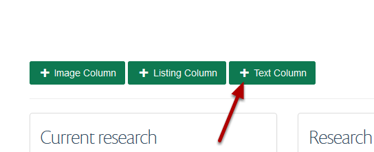
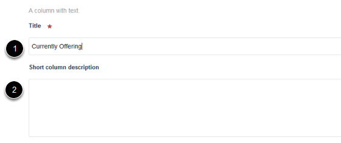
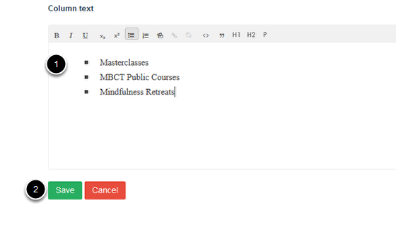

Add a Text Column
======================================================================================================

.. note:: these user guides are being phased out and replaced with the guides on `Haiku Knowledge Base <https://fry-it.atlassian.net/wiki/display/HKB/Haiku+Knowledge+Base>`_

This show you how to create a text column. You can create up to three columns which appear towards the bottom of a research group page. You need to be logged in to create new columns.	

Text columns 
-------------------------------------------------------------------------------------------

   

A text column enables you to create a block of text or a list. 
If you want to create a set of subpages linked to from the column you need to create a listing column (for details on how to create a listing column see the **Add a Listing Column** guide).

Adding the column
-------------------------------------------------------------------------------------------

   

To add a new column to your page scroll down the page and click on the **+ Text Column** button.

Creating the column title and description
-------------------------------------------------------------------------------------------

   

1. Enter the title for your column.
2. You can enter a short description of your column content. (This doesn't display but is useful for search results.)

Entering column content
-------------------------------------------------------------------------------------------

   

Enter your content in the **Column text** box. 
Click on **Save**. 

