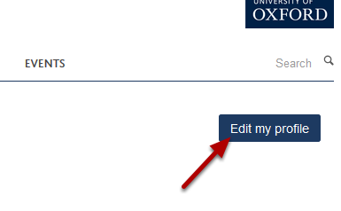
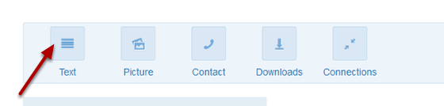
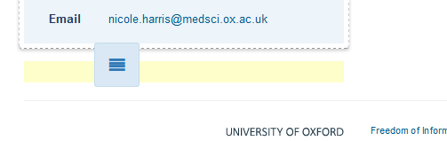
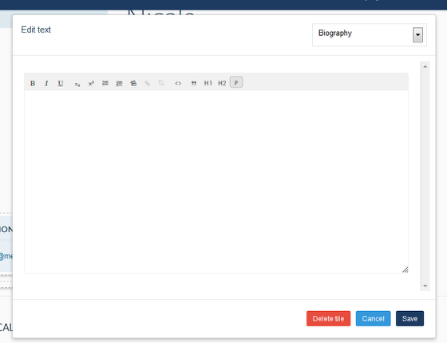
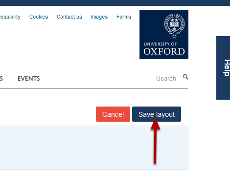

Add a Text Tile to your Profile
======================================================================================================

When your profile is first created you have an editable area of text running down the middle of the page. If you would like to add text to other parts of your profile you need to add a Text Tile first. This shows you how to do this. 	

Edit your profile
-------------------------------------------------------------------------------------------

   

Log in to the site and go to your profile. Click on the Edit my profile button on the top left hand side of the screen.

Tiles
-------------------------------------------------------------------------------------------

   

You will now see a set of icons at the top of your Profile. Click on Text and keeping your mouse button pressed down drag the icon to the part of your page where you would like to add the Text Tile (for example underneath your contact details). 

   

When you get to a section of your page where you can place the tile you will notice that the a pale coloured box appears. Letting go of your mouse button will place the Text Tile in place of the coloured box. 

Add text
-------------------------------------------------------------------------------------------

   

You can now add text to the tile. Once you have finished editing your content click on the **Save** button. 

Save layout
-------------------------------------------------------------------------------------------

   

Click on the **Save layout** button.

