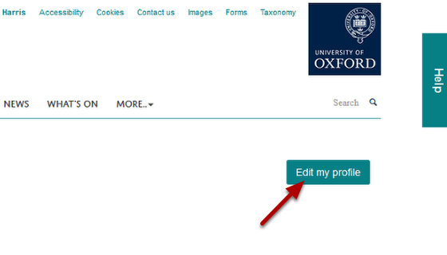
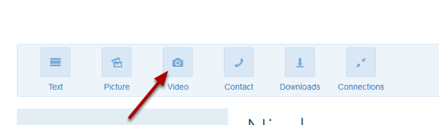
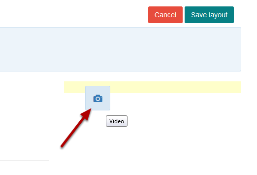
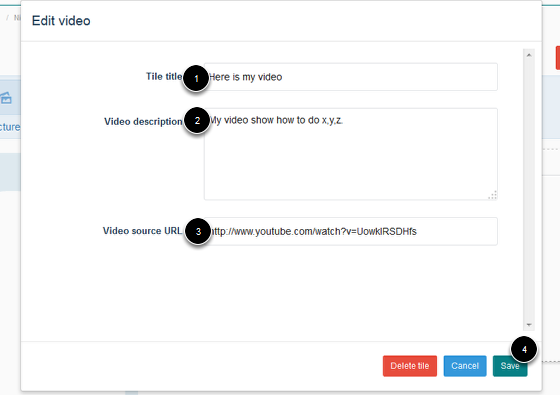
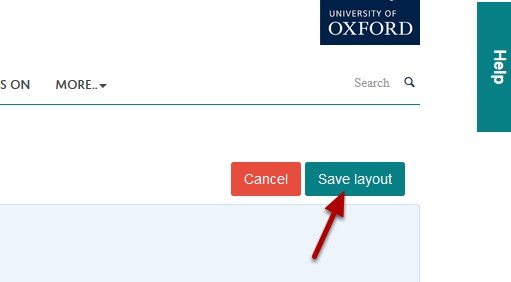
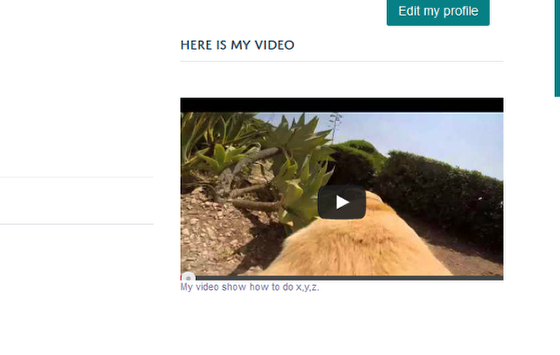

Add a Video to your Profile
======================================================================================================

.. note:: These user guides are being phased out and replaced with the guides on `Haiku Knowledge Base <https://fry-it.atlassian.net/wiki/display/HKB/Haiku+Knowledge+Base>`_

You can add a YouTube video to your profile.	

Edit profile
-------------------------------------------------------------------------------------------

   

Click on **Edit my profile.**

   

You will now see a toolbar with different tiles you can add to your profile. Click on the **Video** icon and holding down your mouse button drag it to where you would like it on your profile:

   

You can position the tile anywhere you see a coloured bar. 

   

1. Enter a title for your video.
2. Describe what viewer will see in your video.
3. Enter the web address of your YouTube video. 
4. Click on **Save**.

Save layout
-------------------------------------------------------------------------------------------

   

Click on the **Save layout** button under the University logo. 

Your video
-------------------------------------------------------------------------------------------

   

