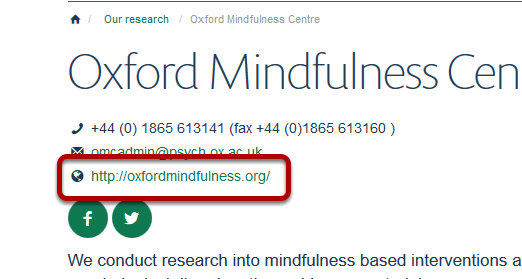
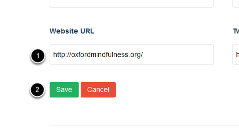

Add a Website Address to your Contact Details
======================================================================================================

.. note:: these user guides are being phased out and replaced with the guides on `Haiku Knowledge Base <https://fry-it.atlassian.net/wiki/display/HKB/Haiku+Knowledge+Base>`_

You can add a website address to the contact details section on your Research Group page:	

   

Edit page
-------------------------------------------------------------------------------------------

   

Log into your site and go to your Research Group page. Click on the **Edit** button on the toolbar at the top left hand side of toolbar at the top of the screen.

Add website address
-------------------------------------------------------------------------------------------

   

Scroll down to the bottom of the page:
1. Add the website address in the **Website URL** box.
2. Click on the **Save** button.

