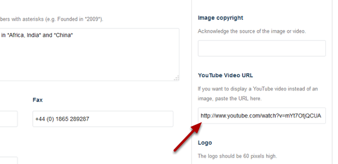

Add a YouTube Video to a Research Group Page
======================================================================================================

.. note:: These user guides are being phased out and replaced with the guides on `Haiku Knowledge Base <https://fry-it.atlassian.net/wiki/display/HKB/Haiku+Knowledge+Base>`_

You can include a YouTube video on a Research Group page instead of an image as shown below. This show you how to do this. 

If you have uploaded an image and have a link to a YouTube video the video will be displayed on your page rather than the image. 	

   

Select Edit
-------------------------------------------------------------------------------------------

   

Go to your Research Group page.
Click on **Edit** on the toolbar at the top of the page.

YouTube Video URL
-------------------------------------------------------------------------------------------

   

Scroll down the page until you reach the **YouTube Video URL** box on the right hand side of the page. Enter the web address of your YouTube video here. 
Scroll to the bottom of the page and click on **Save**.

