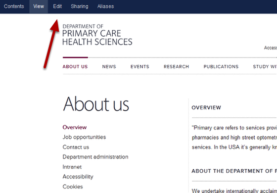
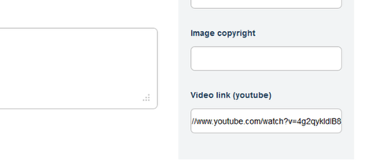
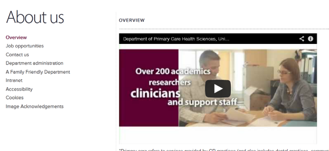

Add a YouTube Video to an About Us page
======================================================================================================

You can add YouTube videos to your site. This shows you how to add a video to an About Us page.	

Find your YouTube video
-------------------------------------------------------------------------------------------

.. image:: images/Add_a_YouTube_Video_to_an_About_Us_page/media_1360658932558.png
   :align: center
   

Find your YouTube video and copy the web address.

Your About Us webpage
-------------------------------------------------------------------------------------------

   

Go to the About us page where you would like to embed the video and click on the Edit button on the blue toolbar at the top of the page. 

Video link
-------------------------------------------------------------------------------------------

   

Scroll down the page until you reach the Video link (YouTube) box which is located on the right hand side of the page. 
Paste the web address of your YouTube video here.
Save your changes - the save button is at the bottom of the page.

   

Your video will appear at the top of your About us page. 

