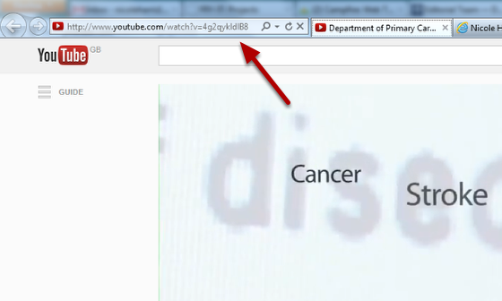
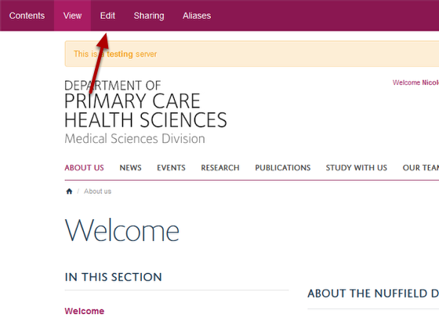
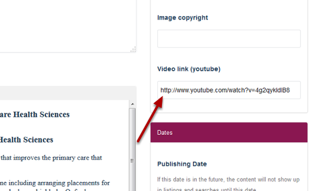

Add a YouTube Video to an About Us page
======================================================================================================

.. note:: these user guides are being phased out and replaced with the guides on `Haiku Knowledge Base <https://fry-it.atlassian.net/wiki/display/HKB/Haiku+Knowledge+Base>`_

You can add YouTube videos to your site. This shows you how to add a video to an About Us page.	

Find your YouTube video
-------------------------------------------------------------------------------------------

   

Find your YouTube video and copy the web address.

Your About Us webpage
-------------------------------------------------------------------------------------------

   

Go to the About us page where you would like to embed the video and click on the **Edit** button on the toolbar at the top of the page. 

Video link
-------------------------------------------------------------------------------------------

   

Scroll down the page until you reach the **Video link (YouTube)** field on the right of the page. 
Paste the web address of your YouTube video here.

Save your changes
-------------------------------------------------------------------------------------------

   

Scroll down to the bottom of the page and click on the **Save** button. 

   

Your video will appear at the top of your About us page. 

