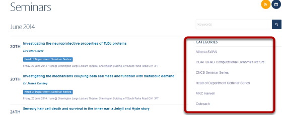
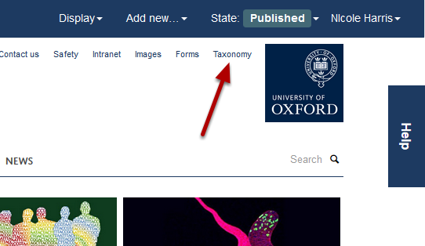
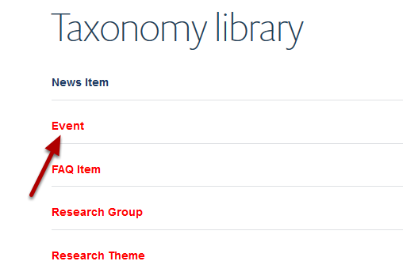
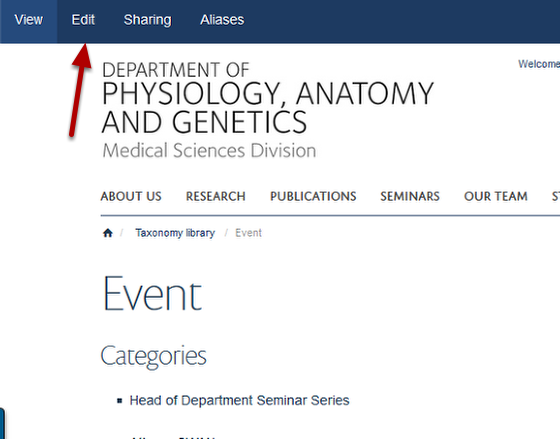
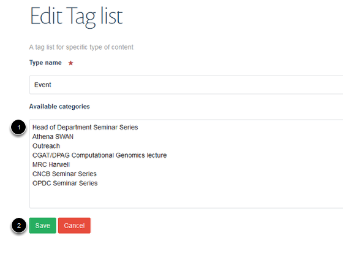

Add a new Category for Events
======================================================================================================

.. note:: These user guides are being phased out and replaced with the guides on `Haiku Knowledge Base <https://fry-it.atlassian.net/wiki/display/HKB/Haiku+Knowledge+Base>`_

Event Categories offer you a way to organise your events and help visitors to your site find what they are looking for. They display on the right side of the Events listing page:	

   

Taxonomy 
-------------------------------------------------------------------------------------------

   

New Categories are added in to the taxonomy section. Click on the **Taxonomy** link at the top of the page.

   

Click on **Event**.

Edit event categories
-------------------------------------------------------------------------------------------

   

Click on **Edit**.

Add new category
-------------------------------------------------------------------------------------------

   

1. Type your new category on a new line in the **Available categories** box.
2. Click on **Save**.

