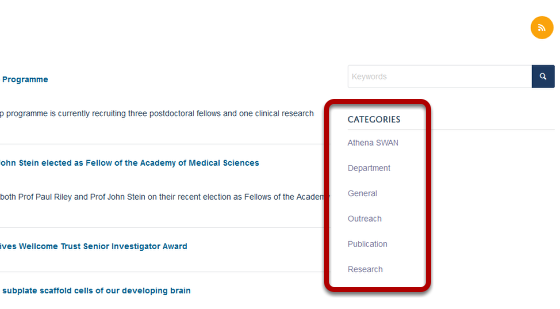
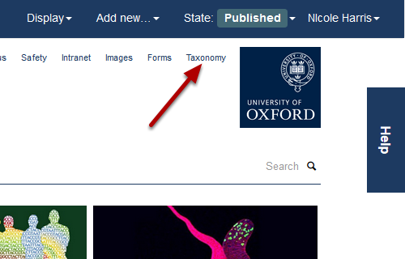
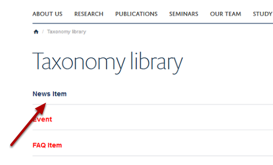
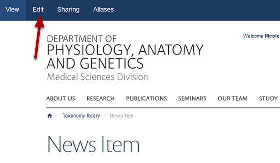
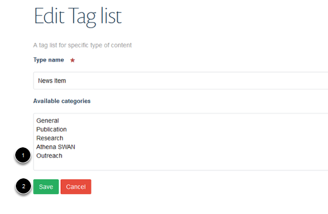
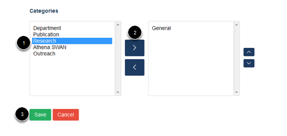

Add a new Category for News
======================================================================================================

News Categories offer you a way to organise your news and help visitors to your site find what they are looking for. They display on the right hand side of the News page:	

   

Taxonomy
-------------------------------------------------------------------------------------------

   

New Categories are added in the taxonomy section. Click on the **Taxonomy** link at the top of the page. 

News Item
-------------------------------------------------------------------------------------------

   

Click on **News Item**.

Edit categories
-------------------------------------------------------------------------------------------

   

Click on **Edit**.

Add new category
-------------------------------------------------------------------------------------------

   

1. Type your new category on a new line in the **Available categories** box. 
2. Click on **Save**.

News Item editing interface
-------------------------------------------------------------------------------------------

   

When adding or creating News items these categories will now be available to you in the Categories lists towards the bottom of the Contents tab on the editing interface. 
Categories in the left hand column are the categories available to you. Categories in the right hand column are categories that have been assigned to the news item. 

To assign a category to a news item:
1. Highlight it in the left hand column.
2. Click on the top arrow to move it to the right hand column.
3. Click on **Save**. 

