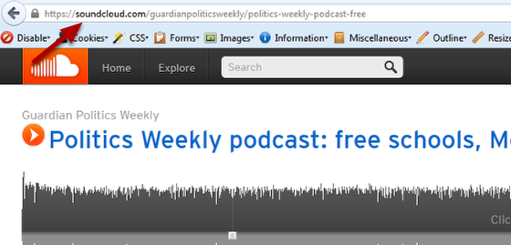
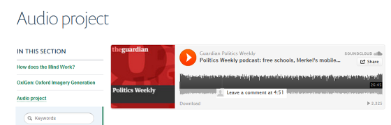

Add an Audio Clip to your Page
======================================================================================================

You can add audio clips that have been stored in SoundCloud or Audioboo to your webpage. 	

Copy web address
-------------------------------------------------------------------------------------------

   

Go to your clip on audioboo or SoundCloud and copy the web address.

Edit page
-------------------------------------------------------------------------------------------

.. image:: images/Add_an_Audio_Clip_to_your_Page/media_1383037761908.png
   :align: center
   

Go to the page where you would like to add an audio clip and click on Edit on the left hand side of the toolbar at the top of the page. 

Paste web address of clip
-------------------------------------------------------------------------------------------

.. image:: images/Add_an_Audio_Clip_to_your_Page/media_1383037966968.png
   :align: center
   

Go to the Video link (youtube) box on the right hand side of the page and paste the web address of your audio clip. 
Save your page - the Save button is at the bottom of the page. 

   

The audio clip displays at the top of your page. 

