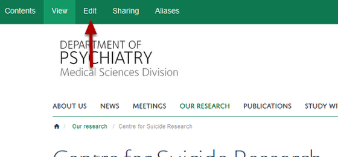
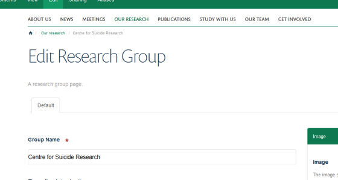
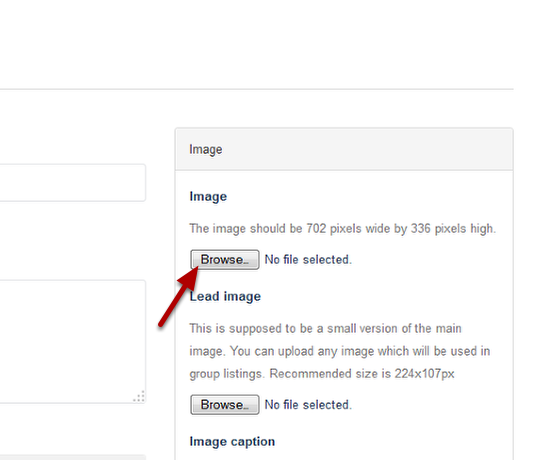
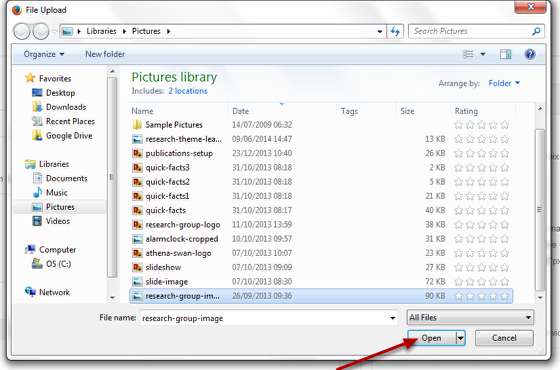
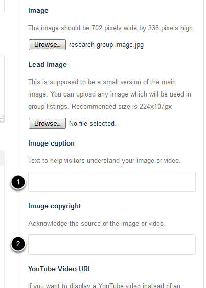

Add an Image to a Research Group page
======================================================================================================

.. note:: these user guides are being phased out and replaced with the guides on `Haiku Knowledge Base <https://fry-it.atlassian.net/wiki/display/HKB/Haiku+Knowledge+Base>`_

Shows you how to add an image to a Research Group page. Images must be 702 pixels wide x 336 pixels wide. 	

Select edit mode
-------------------------------------------------------------------------------------------

   

Go to the Research Group page. Click on **Edit** on the tool bar at the top of the page to bring up the editing interface: 

   

Add image
-------------------------------------------------------------------------------------------

   

Click on **Browse...** under the Image heading. 

   

Navigate to your image and click on **Open**.

Caption and copyright
-------------------------------------------------------------------------------------------

   

1. You can enter a caption for your image which will appear at the bottom of your image.
2. Enter any copyright information for your image. This displays in small white text at the top right hand side of your image.

Save
-------------------------------------------------------------------------------------------

   

When you click on the Save button at the bottom of the page your image will be uploaded onto your Research Group page. 

