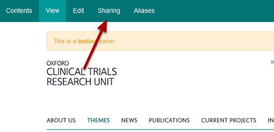
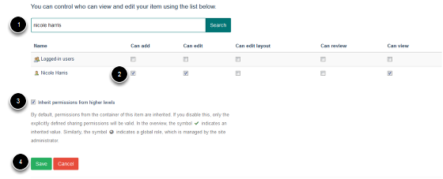
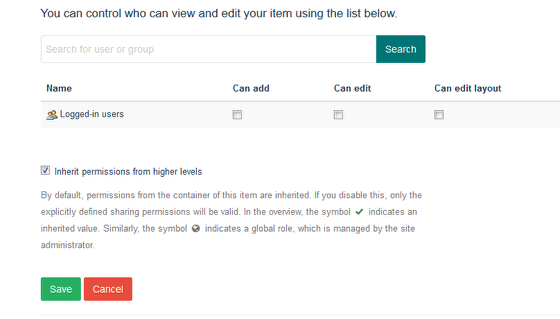

Adding Group Editors
======================================================================================================

.. note:: These user guides are being phased out and replaced with the guides on `Haiku Knowledge Base <https://fry-it.atlassian.net/wiki/display/HKB/Haiku+Knowledge+Base>`_

.. note:: These user guides are being phased out and replaced with the guides on `Haiku Knowledge Base <https://fry-it.atlassian.net/wiki/display/HKB/Haiku+Knowledge+Base>`_

How to add an editor who can only edit a group page. This tutorial is for editors in chief (or those who have site administrator rights). 	

Use the Sharing link on the group page
-------------------------------------------------------------------------------------------

   

Find the Group and click the Sharing link on the left. If you can't see this link, then you don't have the rights to assign an editor to a group and will need to ask your Editor in Chief for help.

Find your editor and assign them to the group
-------------------------------------------------------------------------------------------

   

# Search for your editor by name (if nothing happens when you do this, go to the next step for an explanation)
# **Tick** the Can Add, Can Edit and Can View boxes.
# Leave the 'Inherit permissions' box **ticked**.
# Click Save.

This will give your editor the rights to edit this group and its columns, but they won't be able to edit anything other than this group.

If you can't find your editor
-------------------------------------------------------------------------------------------

   

If nothing happens when you search for a person, then this means that you need to create a new user. 

In this case, follow the Add New User tutorial and then come back to this section.

