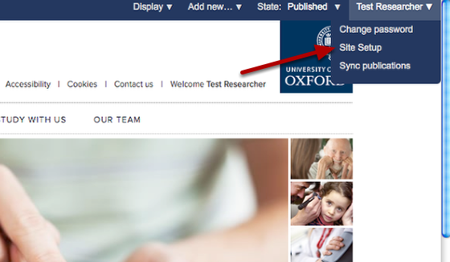
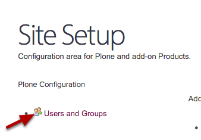
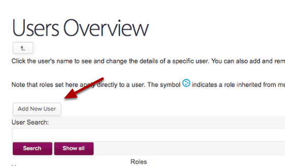
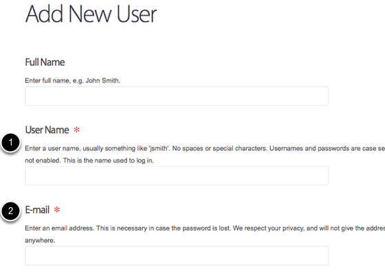
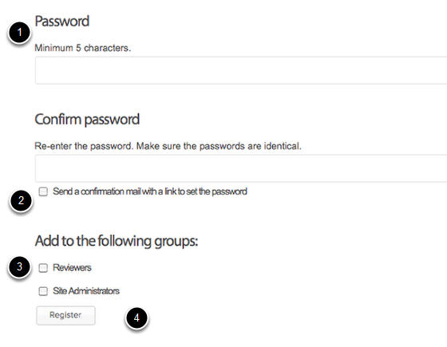

Adding a New User
======================================================================================================

Most users are added automatically - but this shows you how to add a user manually.	

Go to Site Setup
-------------------------------------------------------------------------------------------

   

You'll find the link to Site Setup in the drop down box below your name. If you can't see that option, you aren't a site administrator, so you'll need to ask your editor in chief for help.

Go to Users and Groups
-------------------------------------------------------------------------------------------

   

Click the Users and Groups option. (Don't panic, the layout of this page still needs to be formatted)

Add your user
-------------------------------------------------------------------------------------------

   

Click the Add New User button. 

(If you're not sure whether the user is already in the system, then you can search for the user by name first)

Supply name, email and username
-------------------------------------------------------------------------------------------

   

# The User Name should be the Oxford username - there are instructions on how to find a username in the Find an Oxford Username tutorial.
# The E-mail should be the usual Oxford email address for this person.

If the person isn't a member of the University, you will need to apply for a Virtual University Card to get them an Oxford username and password to use for login and editing.

Additional details
-------------------------------------------------------------------------------------------

   

# You are asked to supply a password, any random password will do and you don't need to remember this. **NB DO NOT put a user's single sign on password here.** 
# **Clear** the 'Send a confirmation mail' box [there's a bug at the moment and if you don't do this the user doesn't get created]
# Unless you want to give the user permissions to edit the entire site, **leave** the 'Add to the following groups' boxes **blank**.
# Click register.

