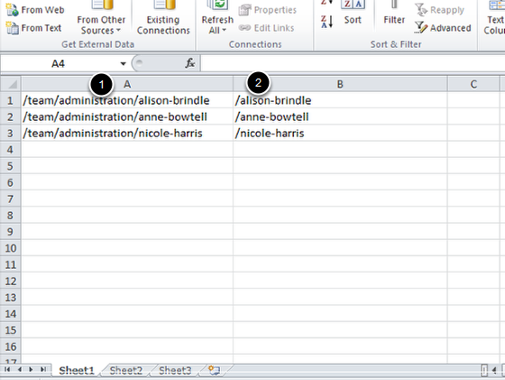
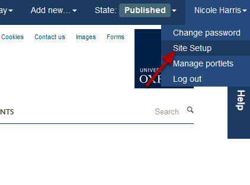
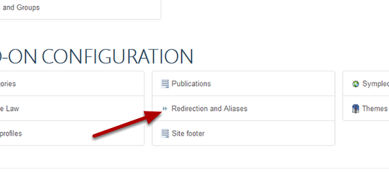
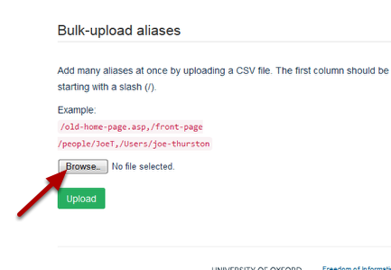
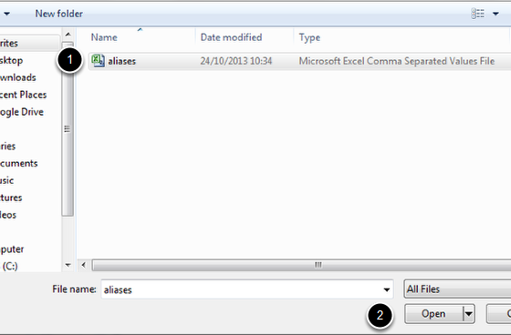
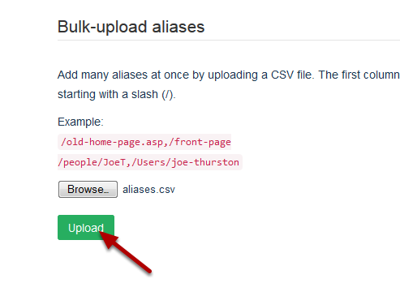

Aliases - Upload a CSV file of Aliases
======================================================================================================

.. note:: These user guides are being phased out and replaced with the guides on `Haiku Knowledge Base <https://fry-it.atlassian.net/wiki/display/HKB/Haiku+Knowledge+Base>`_

.. note:: These user guides are being phased out and replaced with the guides on `Haiku Knowledge Base <https://fry-it.atlassian.net/wiki/display/HKB/Haiku+Knowledge+Base>`_

Aliases give you the option to provide an alternative web address for a page on your website. 
If you wish to create a number of aliases you might find it easier to upload a CSV file of aliases rather than creating aliases for each page individually. This shows you how to do this. (For details on how to set up aliases for a single page see the Set up an Alias / Give a Page an Alternate Web Address guide.)	

Create your CSV file
-------------------------------------------------------------------------------------------

   

You need to create a two column CSV file:
1. The first column is a list of the current web addresses you would like to create aliases for. Don't include the first part of the web address (e.g. www.medsci.ox.ac.uk) - start with the slash after ox.ac.uk
2. The second column is the list of the aliases you would like for the pages in column one. 

Save your file. (If using Excel to create your file change the file type to CSV from the default Excel Workbook option.)

Once you have created your file login to your website.

Site Setup
-------------------------------------------------------------------------------------------

   

Click on your name on the right hand side of the toolbar at the top of the page and select **Site Setup** from the drop down list. 

Redirection and Aliases
-------------------------------------------------------------------------------------------

   

Click on **Redirection and Aliases**.

Select file
-------------------------------------------------------------------------------------------

   

Click on the **Browse...** button and navigate to your file:

   

1. Click on the name of your file.
2. Click on the **Open** button.

Upload file
-------------------------------------------------------------------------------------------

   

Click on the **Upload** button to create your aliases. 

