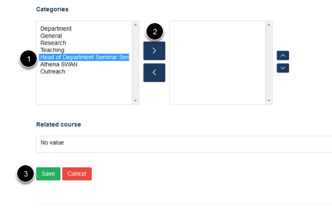

Assign Categories to an Event
======================================================================================================

.. note:: These user guides are being phased out and replaced with the guides on `Haiku Knowledge Base <https://fry-it.atlassian.net/wiki/display/HKB/Haiku+Knowledge+Base>`_

Event Categories offer you a way to organise your events and help visitors to your site find what they are looking for. 	

Events
-------------------------------------------------------------------------------------------

.. image:: images/Assign_Categories_to_an_Event/media_1401803628077.png
   :align: center
   

Go to the Event page you would like to assign a category to and click on **Edit** from the left hand side of the toolbar at the top of the page. 

Categories 
-------------------------------------------------------------------------------------------

   

Scroll down the page until you reach the **Categories** section. 
The box on the left lists categories which haven't been assigned to your event. The box on the right lists categories which have been assigned to your event. 

To assign a category to your event: 
1. Highlight the term that you would like to assign to your event.
2. Move the highlighted term to the right hand box by clicking on the top arrow.
3. Click on **Save**. 

(If the term that you would like to assign to your event is not available you will need to ask your editor-in-chief to add this for you.)

