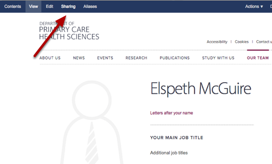
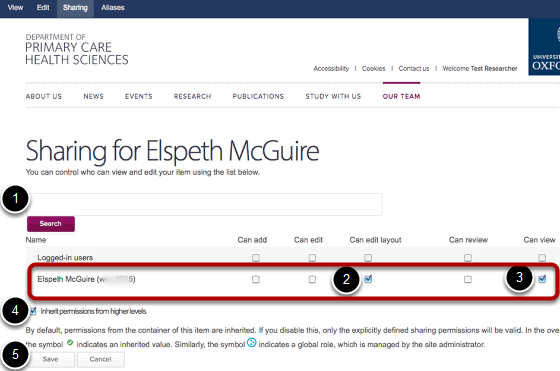
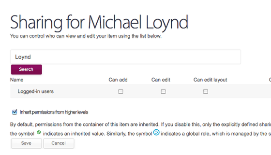

Assign a User to Edit a Profile
======================================================================================================

Usually a user will be assigned to edit a profile automatically, but if this hasn't happened (or you would like to delegate profile editing to someone else) then this is the manual process.	

Click the Sharing button
-------------------------------------------------------------------------------------------

   

Make sure you are on the relevant profile and click the Sharing button on the top left. 

If you can't see the dark blue bar and this button then you probably don't have permission to do this and you should consult your editor in chief.

Search for the user and assign them rights
-------------------------------------------------------------------------------------------

   

# Search for the user by name.
# Tick the Can edit layout and ...
# Tick the Can view boxes next to that user's name - make sure you are ticking the boxes for that user and not Logged-in users
# Leave the Inherit permissions box ticked
# Click Save.

If you can't find your user
-------------------------------------------------------------------------------------------

   

If nothing happens when you search for a person, then this means that you need to create a new user. 

In this case, follow the Add New User tutorial and then come back to this section.

