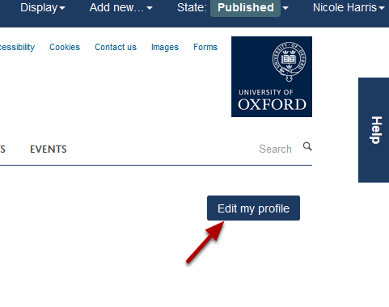
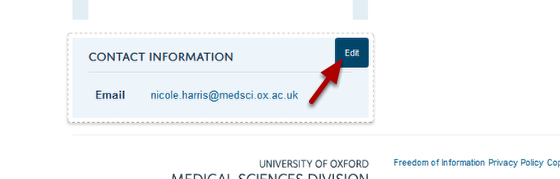
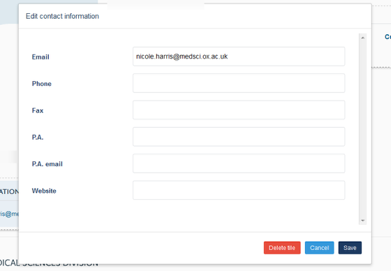
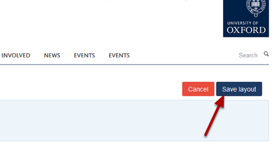

Change / Add Contact Details on your Profile
======================================================================================================

.. note:: These user guides are being phased out and replaced with the guides on `Haiku Knowledge Base <https://fry-it.atlassian.net/wiki/display/HKB/Haiku+Knowledge+Base>`_

ou need to be logged in to make changes to your profile. 	

Edit profile
-------------------------------------------------------------------------------------------

   

Go to your profile and click on the **Edit** button.

Contact information
-------------------------------------------------------------------------------------------

   

Move your cursor over the Contact Information area to bring up the **Edit** button. Click on **Edit**.

   

Change / add details as appropriate and click on **Save**.

Save the profile
-------------------------------------------------------------------------------------------

   

Click on the **Save layout** button. 

