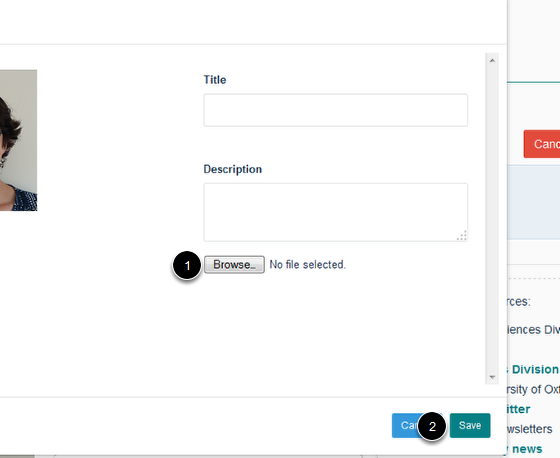

Change a Profile Image
======================================================================================================

This shows you how to replace an image on a profile. If you want to delete an image without replacing it please follow the instructions in the Delete a Profile Image tutorial.	

Go to profile
-------------------------------------------------------------------------------------------

   

Go to the profile where you would like to change the image. 
Click on **Edit my profile**.

Change the image
-------------------------------------------------------------------------------------------

   

Move your cursor over the profile image to bring up the **Edit** button. Click on the Edit button to bring up the editing interface:

   

1. Click on **Browse ...** and upload the new image.
2. Click on Save.

Save layout
-------------------------------------------------------------------------------------------

   

Click on the **Save layout** button. 

