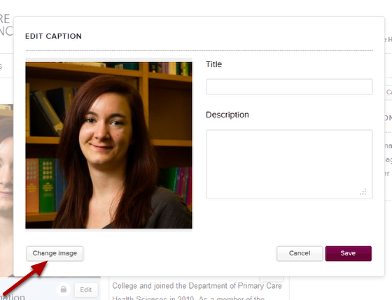

Change a Profile Image
======================================================================================================

This shows you how to replace an image on a profile. If you want to delete an image without replacing it please follow the instructions in the Delete a Profile Image tutorial.	

Find the profile
-------------------------------------------------------------------------------------------

   

Go to the profile where you would like to change the image. 
Click on the Edit button.

Changing the image
-------------------------------------------------------------------------------------------

   

Double click on the image to bring up the following editing box:

   

Click on the Change image button

Upload the new image
-------------------------------------------------------------------------------------------

   

1. Click on the Browse... button and find the image on your computer. 
2. Click on OK.

Save layout
-------------------------------------------------------------------------------------------

   

Click on the Save layout button. 

