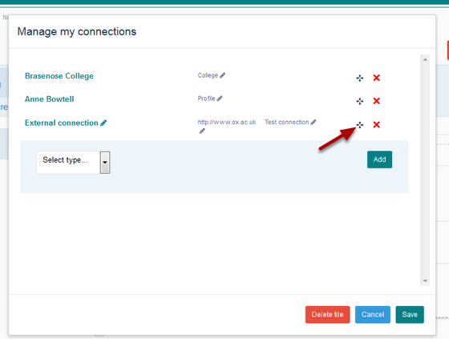
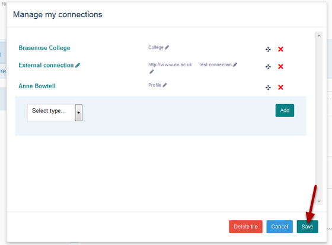
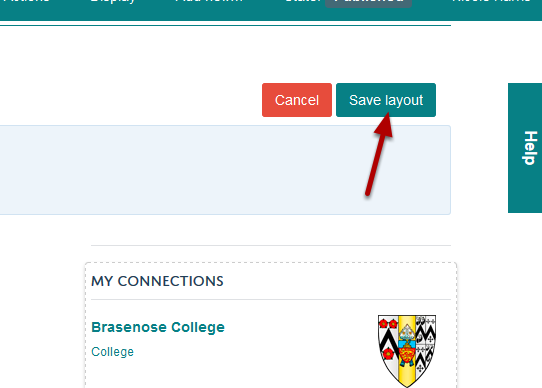

Change the Display Order of Connections on your Profile
======================================================================================================

.. note:: These user guides are being phased out and replaced with the guides on `Haiku Knowledge Base <https://fry-it.atlassian.net/wiki/display/HKB/Haiku+Knowledge+Base>`_

You can change the order in which connections display on your profile. This shows you how to do this. 	

Edit profile
-------------------------------------------------------------------------------------------

.. image:: images/Change_the_Display_Order_of_Connections_on_your_Profile/media_1403618877284.png
   :align: center
   

Click on the **Edit my profile** button.

Edit Connections
-------------------------------------------------------------------------------------------

.. image:: images/Change_the_Display_Order_of_Connections_on_your_Profile/media_1403618904340.png
   :align: center
   

To edit your connections click on the **Edit** button on the top right hand side of your list of connections. The button will appear when you hover over the list of connections. 

Move a connection
-------------------------------------------------------------------------------------------

   

Click on the gray four way arrows and keeping your mouse button held down drag the connection to where you would like it to display. 

Save your changes
-------------------------------------------------------------------------------------------

   

Click on the **Save** button.

Save layout
-------------------------------------------------------------------------------------------

   

Click on the **Save layout** button.

