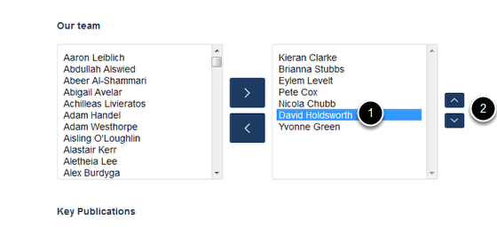

Change the Display Order of Research Group Members
======================================================================================================

Shows you how to change the order in which group members are displayed on a research group page.	

Select edit mode
-------------------------------------------------------------------------------------------

.. image:: images/Change_the_Display_Order_of_Research_Group_Members/media_1401777200764.png
   :align: center
   

Go to the Research section of your website and find the Research Group page you would like to edit. 
Click on **Edit** on the tool bar at the top of the page to go to the editing interface: 

   

Change the display order
-------------------------------------------------------------------------------------------

   

Scroll down the page until you reach the **Our team** section. 
1. Select the name you would like to move in the right hand column.
2. Use the up and down arrows to change the order.

Save your changes
-------------------------------------------------------------------------------------------

   

Scroll down to the bottom of the page. Click on **Save**. 

