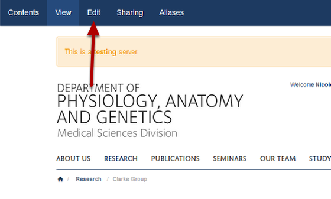
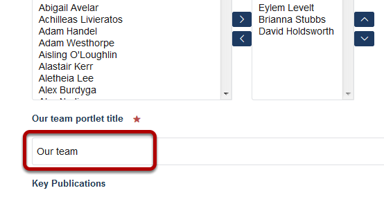
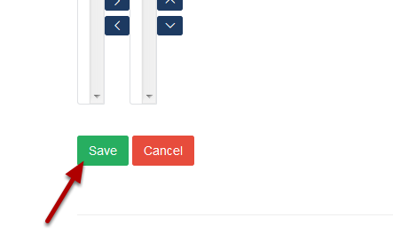

Change the Heading of the List of Team Members
======================================================================================================

You can change the heading of the list of team members on Research Group pages, which by default is Our Team. This shows you how to do this.  	

Edit Research Group page
-------------------------------------------------------------------------------------------

   

Click on **Edit** on the top left of the toolbar at the top of the page. 

Our team portlet title
-------------------------------------------------------------------------------------------

   

Scroll down the page until you reach the **Our team portlet title**. Enter your title here. By detault this is Our Team.

Save
-------------------------------------------------------------------------------------------

   

Click on the **Save** button at the bottom of the page. 

