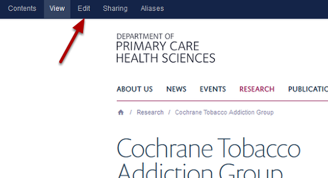
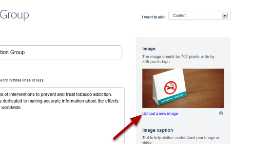
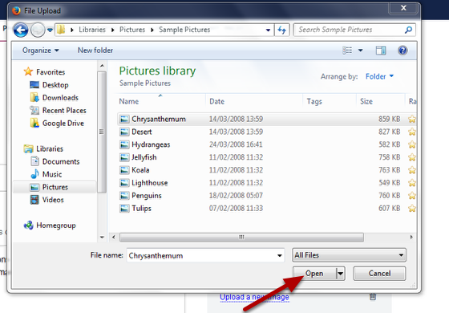
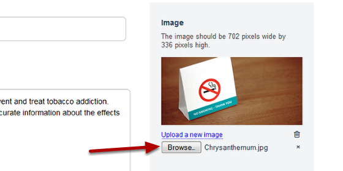

Change the Image on a Research Group page
======================================================================================================

Shows you how to change the image on a Research Group page. Images on Research Group pages must be 702 pixels wide x 336 pixels high.	

Switch to Edit mode
-------------------------------------------------------------------------------------------

   

Go to the Research Group page you would like to edit and click on Edit on the top left hand side of the tool bar at the top of the page. 

Replace your image
-------------------------------------------------------------------------------------------

   

Click on Upload a new image

Find your new image
-------------------------------------------------------------------------------------------

   

Navigate to your new image and click on Open. (Your image must be 702 pixels wide by 336 pixels high.)
After clicking on open you will see that the name of your image appears in the text box next to the Browse button:

   

If you click on the Browse... button you can reselect your image. If you are happy with your selection save your page (the save button is at the bottom of the page). 

