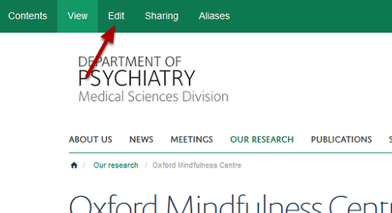
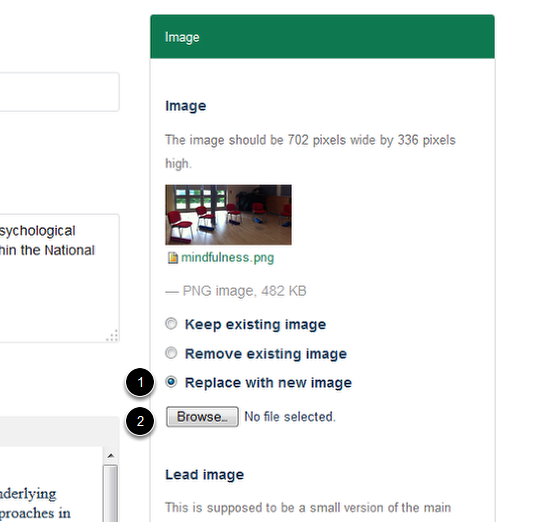
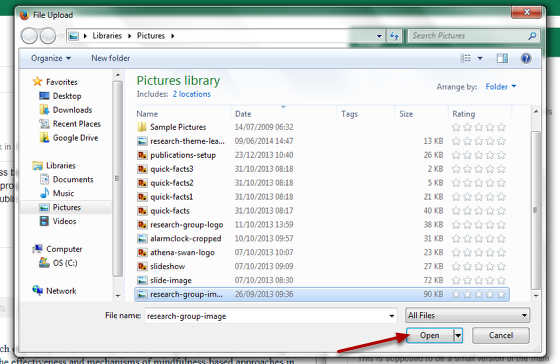
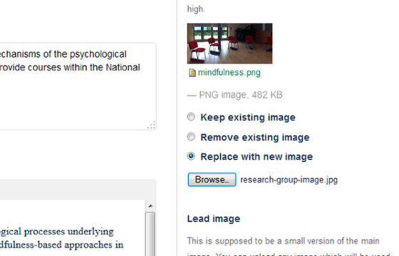
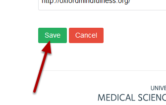

Change the Image on a Research Group page
======================================================================================================

Shows you how to change the image on a Research Group page. Images on Research Group pages must be 702 pixels wide x 336 pixels high.	

Switch to Edit mode
-------------------------------------------------------------------------------------------

   

Go to your Research Group page. Click on **Edit** on the toolbar at the top of the page.

Replace your image
-------------------------------------------------------------------------------------------

   

1. Select **Replace with new image.**
2. Click on **Browse...**

Find your new image
-------------------------------------------------------------------------------------------

   

Navigate to your new image and click on **Open**. (Your image must be 702 pixels wide by 336 pixels high.)
After clicking on open you will see that the name of your image appears in the text box next to the Browse button:

   

Save image
-------------------------------------------------------------------------------------------

   

Scroll to the bottom of the page. 
Click on **Save**.

