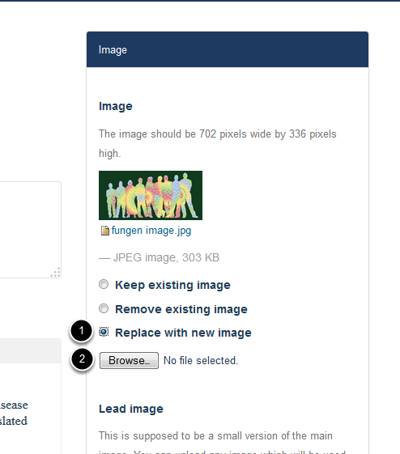
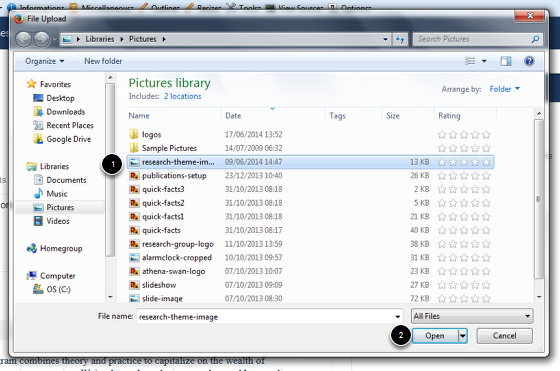
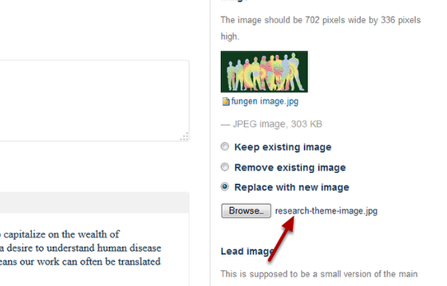

Change the Image on a Research Theme Page
======================================================================================================

.. note:: These user guides are being phased out and replaced with the guides on `Haiku Knowledge Base <https://fry-it.atlassian.net/wiki/display/HKB/Haiku+Knowledge+Base>`_

Shows you how to change the image on a Research Theme page.	

Edit Research Theme
-------------------------------------------------------------------------------------------

   

Go to the Research Theme page and click on **Edit** on the tool bar at the top of the page.

Replace your image
-------------------------------------------------------------------------------------------

   

1. Click on Replace with new image.
2.Click on the Browse... button to bring up a File Upload box.

Find your new image
-------------------------------------------------------------------------------------------

   

1. Select your image. (Your image must be 702 pixels wide by 336 pixels high.)
2. Click on **Open**.

   

The name of your new image is now displayed next to the **Browse...** button.

Save the change
-------------------------------------------------------------------------------------------

   

Scroll to the bottom of the page. Click on **Save**.

