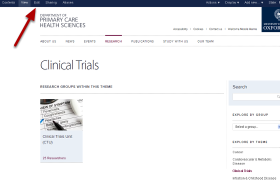
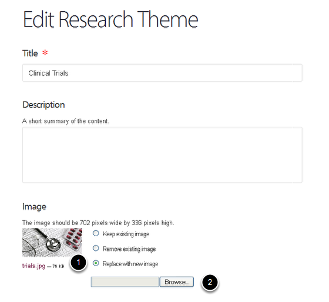
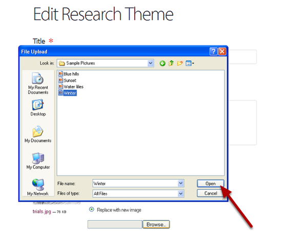
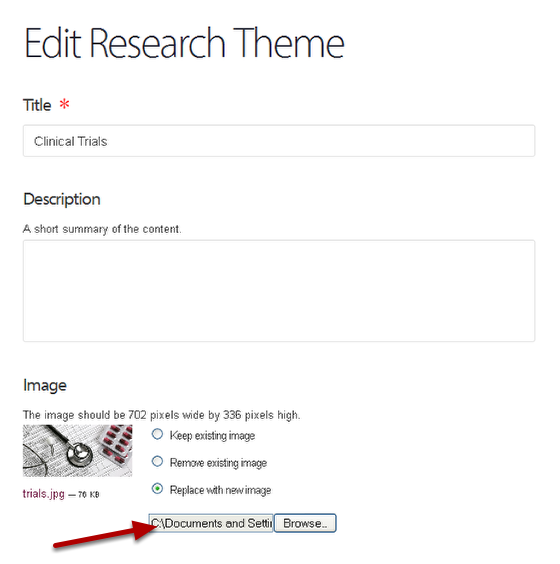
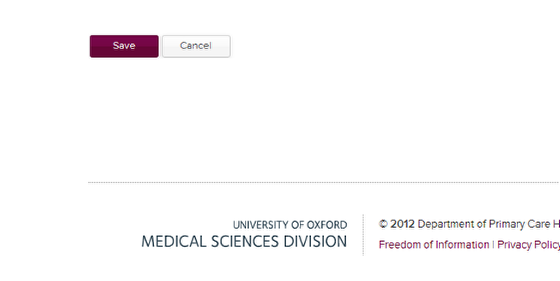

Change the Image on a Research Theme Page
======================================================================================================

Shows you how to change the image on a Research Theme page.	

Switch to Edit mode on your Research Theme page
-------------------------------------------------------------------------------------------

   

Go to the Research Theme page and click on Edit on the tool bar at the top of the page.

Replace your image
-------------------------------------------------------------------------------------------

   

1. Click on Replace with new image.
2.Click on the Browse... button to bring up a File Upload box.

Find your new image
-------------------------------------------------------------------------------------------

   

Navigate to your new image and click on Open. (Your image must be 702 pixels wide by 336 pixels high.)
After clicking on open you will see that the location of your image appears in the text box next to the Browse button:

   

Save the change
-------------------------------------------------------------------------------------------

   

Click on save at the bottom of the page.

