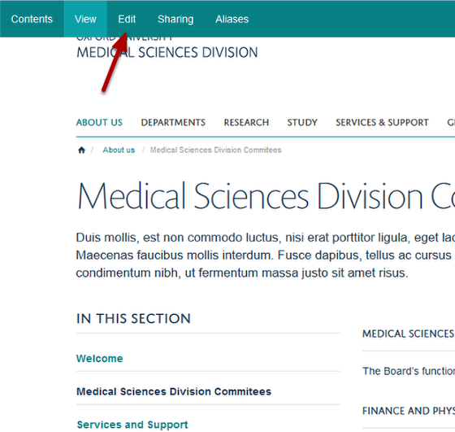
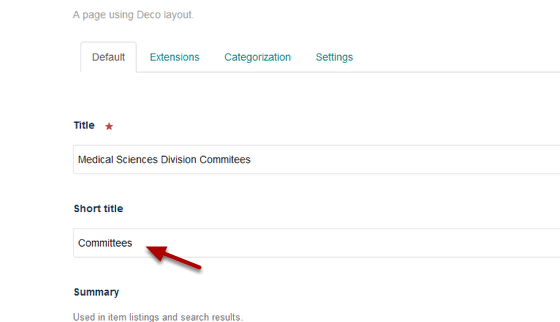
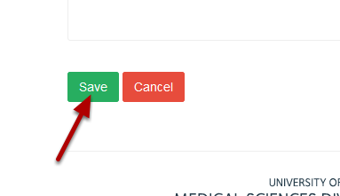
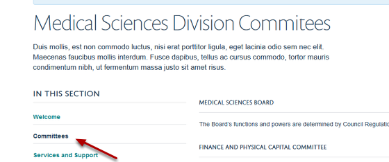

Change the Link Name in the Lefthand Navigation Bar
======================================================================================================

By default the link name for a page on the lefthand navigation is the same as the title of the page. You might want to change this - for example if the page title is quite long. 

In this example we will change the link on the left hand navigation from **Medical Sciences Division Committees** to **Committees**. 	

Find your page
-------------------------------------------------------------------------------------------

   

Go to the page where you would like to change the name of the navigation. 
Click on **Edit** on the top tool bar. 

New title
-------------------------------------------------------------------------------------------

   

Enter the new name into the **Short title** field.

Save the change
-------------------------------------------------------------------------------------------

   

Scroll down to the bottom of the page and click on the **Save** button.

   

You will now see that the name of the page in the lefthand navigation has changed to Committees.

