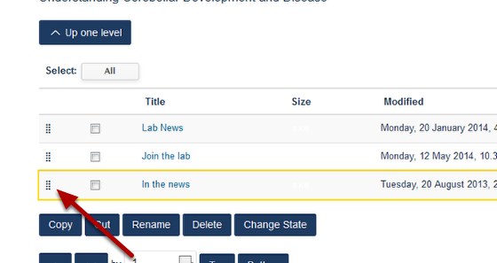

Change the Order of Columns
======================================================================================================

.. note:: These user guides are being phased out and replaced with the guides on `Haiku Knowledge Base <https://fry-it.atlassian.net/wiki/display/HKB/Haiku+Knowledge+Base>`_

Shows you how to change the order in which columns are displayed on your research group page. By default columns are displayed in the order they were added. 	

Switch to Contents mode
-------------------------------------------------------------------------------------------

   

Go to your Research Group and click on **Contents** on the toolbar at the top of the screen. You will then see the following screen which lists your columns by column title:

Changing the order of the columns
-------------------------------------------------------------------------------------------

   

To change the order of a column click on the set of dots to the left of the column name. This will will highlight the column. Keeping your mouse button pressed down you can drag it to the correct position (the top column is the left hand column on the website). 

