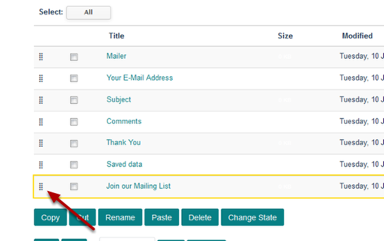

Change the Order of Form Fields
======================================================================================================

.. note:: These user guides are being phased out and replaced with the guides on `Haiku Knowledge Base <https://fry-it.atlassian.net/wiki/display/HKB/Haiku+Knowledge+Base>`_

You can change the order of fields in your form. This shows you how to do this. 	

Form Contents
-------------------------------------------------------------------------------------------

   

Go to your form. Click on **Contents** on the toolbar at the top of the page. 

Move field
-------------------------------------------------------------------------------------------

   

You will see a list of all the fields in your form - this is the order that they display on screen. To move an item click on the dots to the left of the field name and drag to the required position. 

