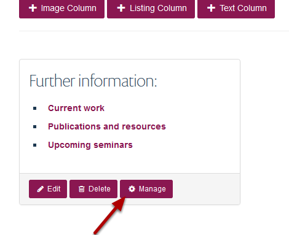
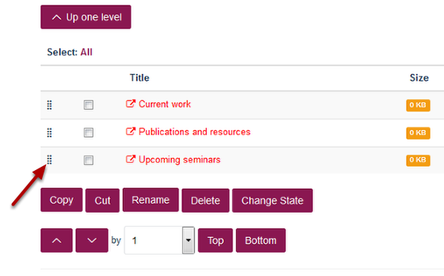
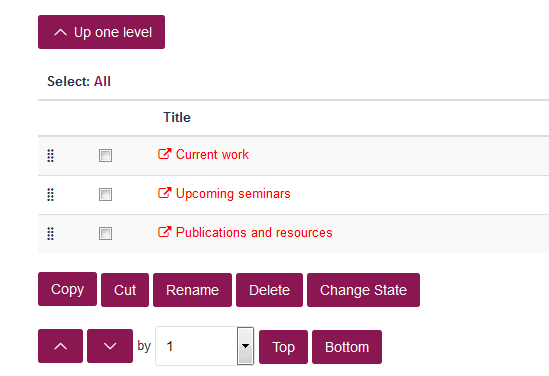
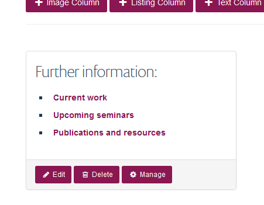

Change the Order of Items in Columns
======================================================================================================

.. note:: These user guides are being phased out and replaced with the guides on `Haiku Knowledge Base <https://fry-it.atlassian.net/wiki/display/HKB/Haiku+Knowledge+Base>`_

You can change the order of items in your columns on research group pages. When you add a new item it is added to the bottom of the column - this shows you how to change this. 	

Manage column
-------------------------------------------------------------------------------------------

   

Go to the column on your Research Group page. 
Click on **Manage**.

Column content
-------------------------------------------------------------------------------------------

   

Click on the set of dots to the left of item you would like to move and drag it to the correct position:

   

which displays in the column as follows:

   

